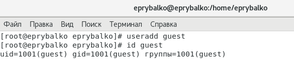
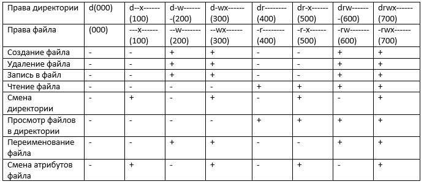
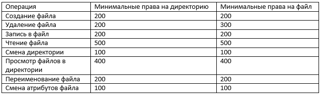

---
# Front matter
lang: ru-RU  
title: "Отчёт по лабораторной работе №2. Дискреционное разграничение прав в Linux. Основные атрибуты"  
subtitle: "дисциплина: Информационная безопасность"  
author: "Рыбалко Элина Павловна"  
teacher: "Дмитрий Сергеевич Кулябов"

# Generic otions
lang: ru-RU
toc-title: "Содержание"

# Bibliography
bibliography: bib/cite.bib
csl: pandoc/csl/gost-r-7-0-5-2008-numeric.csl

# Pdf output format
toc: true # Table of contents
toc_depth: 2
lof: true # List of figures
lot: true # List of tables
fontsize: 12pt
linestretch: 1.5
papersize: a4
documentclass: scrreprt
## I18n
polyglossia-lang:
  name: russian
  options:
  - spelling=modern
  - babelshorthands=true
polyglossia-otherlangs:
  name: english
### Fonts
mainfont: PT Serif
romanfont: PT Serif
sansfont: PT Sans
monofont: PT Mono
mainfontoptions: Ligatures=TeX
romanfontoptions: Ligatures=TeX
sansfontoptions: Ligatures=TeX,Scale=MatchLowercase
monofontoptions: Scale=MatchLowercase,Scale=0.9
## Biblatex
biblatex: true
biblio-style: "gost-numeric"
biblatexoptions:
  - parentracker=true
  - backend=biber
  - hyperref=auto
  - language=auto
  - autolang=other*
  - citestyle=gost-numeric
## Misc options
indent: true
header-includes:
  - \linepenalty=10 # the penalty added to the badness of each line within a paragraph (no associated penalty node) Increasing the value makes tex try to have fewer lines in the paragraph.
  - \interlinepenalty=0 # value of the penalty (node) added after each line of a paragraph.
  - \hyphenpenalty=50 # the penalty for line breaking at an automatically inserted hyphen
  - \exhyphenpenalty=50 # the penalty for line breaking at an explicit hyphen
  - \binoppenalty=700 # the penalty for breaking a line at a binary operator
  - \relpenalty=500 # the penalty for breaking a line at a relation
  - \clubpenalty=150 # extra penalty for breaking after first line of a paragraph
  - \widowpenalty=150 # extra penalty for breaking before last line of a paragraph
  - \displaywidowpenalty=50 # extra penalty for breaking before last line before a display math
  - \brokenpenalty=100 # extra penalty for page breaking after a hyphenated line
  - \predisplaypenalty=10000 # penalty for breaking before a display
  - \postdisplaypenalty=0 # penalty for breaking after a display
  - \floatingpenalty = 20000 # penalty for splitting an insertion (can only be split footnote in standard LaTeX)
  - \raggedbottom # or \flushbottom
  - \usepackage{float} # keep figures where there are in the text
  - \floatplacement{figure}{H} # keep figures where there are in the text
---

# Цель работы

Получение практических навыков работы в консоли с атрибутами файлов, закрепление теоретических основ дискреционного разграничения доступа в современных системах с открытым кодом на базе ОС Linux.

#  Техническое обеспечение
Лабораторная работа подразумевает наличие на виртуальной машине VirtualBox операционной системы Linux (дистрибутив Rocky или CentOS).
Выполнение работы возможно как в дисплейном классе факультета физико-математических и естественных наук РУДН, так и дома. Описание выполнения работы приведено для дисплейного класса со следующими характеристиками:
– Intel Core i3-550 3.2 GHz, 4 GB оперативной памяти, 20 GB свободного
места на жёстком диске;
– ОС Linux Gentoo (http://www.gentoo.ru/);
– VirtualBox верс. 6.1 или старше;
– каталог с образами ОС для работающих в дисплейном классе: /afs/dk.sci.pfu.edu.ru/common/files/iso/.
  

# Объект/Предмет исследования

Операционная система Linux.

# Теоретическое введение

В Linux, как и в любой многопользовательской системе, абсолютно естественным образом возникает задача разграничения доступа субъектов — пользователей к объектам — файлам дерева каталогов.

Один из подходов к разграничению доступа — так называемый дискреционный (от англ, discretion — чье-либо усмотрение) — предполагает назначение владельцев объектов, которые по собственному усмотрению определяют права доступа субъектов (других пользователей) к объектам (файлам), которыми владеют.

Дискреционные механизмы разграничения доступа используются для разграничения прав доступа процессов как обычных пользователей, так и для ограничения прав системных программ в (например, служб операционной системы), которые работают от лица псевдопользовательских учетных записей.  [[2]](#список-литературы).

# Выполнение лабораторной работы

1. В установленной при выполнении предыдущей лабораторной работы операционной системе создайте учётную запись пользователя guest (использую учётную запись администратора) (см. рис. -@fig:001).

{ #fig:001 width=70% } 

2. Задайте пароль для пользователя guest (использую учётную запись администратора) (см. рис. -@fig:002).

{ #fig:002 width=70% } 

3. Войдите в систему от имени пользователя guest. (см. рис. -@fig:003).

{ #fig:003 width=70% } 

4. Определите директорию, в которой вы находитесь, командой pwd. Сравните её с приглашением командной строки. Определите, является ли она вашей домашней директорией? Если нет, зайдите в домашнюю директорию (см. рис. -@fig:004).

    Директория, в которой мы находимся совпадает с приглашением командной строки и с домашней директорией.

{ #fig:004 width=70% } 

5. Уточните имя вашего пользователя командой whoami (см. рис. -@fig:005).

{ #fig:005 width=70% } 

6. Уточните имя вашего пользователя, его группу, а также группы, куда входит пользователь, командой id. Выведенные значения uid, gid и др. запомните. Сравните вывод id с выводом команды groups (см. рис. -@fig:006).

{ #fig:006 width=70% } 

7. Сравните полученную информацию об имени пользователя с данными, выводимыми в приглашении командной строки. 

    Информация совпадает.

8. Просмотрите файл /etc/passwd командой cat /etc/passwd. Найдите в нём свою учётную запись. Определите uid пользователя.
Определите gid пользователя. Сравните найденные значения с полученными в предыдущих пунктах (см. рис. -@fig:007, -@fig:008). 

{ #fig:007 width=70% } 

{ #fig:008 width=70% } 

9. Определите существующие в системе директории. (см. рис. -@fig:009).
Удалось ли вам получить список поддиректорий директории /home? Какие права установлены на директориях?

    Список поддерикторий получить не удалось. Обе директории имеют права на чтение, запись и исполнение только для владельца директорий.

{ #fig:009 width=70% } 

10. Проверьте, какие расширенные атрибуты установлены на поддиректориях, находящихся в директории /home (см. рис. -@fig:010).
Удалось ли вам увидеть расширенные атрибуты директории? Удалось ли вам увидеть расширенные атрибуты директорий других пользователей?
    
    Посмотреть расширенные атрибуты удалось только для пользователя guest. Они отсутствуют. 

{ #fig:010 width=70% } 

11. Создайте в домашней директории поддиректорию dir1. Определите командами ls -l и lsattr, какие права доступа и расширенные атрибуты были выставлены на директорию dir1 (см. рис. -@fig:011).
Созданная поддиректория имеет права на чтение, запись и исполнение для владельца директории и для группы, у остальных только на чтение и исполнение.

{ #fig:011 width=70% } 

12. Снимите с директории dir1 все атрибуты командой chmod 000 dir1 и проверьте с её помощью правильность выполнения команды ls -l (см. рис. -@fig:012).

{ #fig:012 width=70% } 

13. Попытайтесь создать в директории dir1 файл file1. Объясните, почему вы получили отказ в выполнении операции по созданию файла?
Оцените, как сообщение об ошибке отразилось на создании файла? Проверьте командой ls -l /home/guest/dir1 действительно ли файл file1 не находится внутри директории dir1 (см. рис. -@fig:013 и рис. -@fig:014). 
    
    В связи с тем, что все атрибуты были сняты с поддиректории, то прав на создание файлов у нас нет.

{ #fig:013 width=70% } 

{ #fig:014 width=70% } 

14. Заполните таблицу «Установленные права и разрешённые действия» (см. рис. -@fig:015). 

{ #fig:015 }

3. На основании заполненной таблицы определите те или иные минимально необходимые права для выполнения операций внутри директории
dir1 (см. рис. -@fig:016).

{ #fig:016 } 

# Вывод

Приобрели практические навыки работы в консоли с атрибутами файлов, закрепление теоретических основ дискреционного разграничения доступа в современных системах с открытым кодом на базе ОС Linux. 

# Список литературы {.unnumbered}

1. [Лабораторная работа №2](https://docs.yandex.ru/docs/view?tm=1663430896&tld=ru&lang=ru&name=002-lab_discret_attr.pdf&text=Лабораторная%20работа%20№%202.%20Дискреционное%20разграничение%20прав%20в%20Linux.%20Основные%20атрибуты%202.1.%20Цель%20работы%20Получение%20практических%20навыков%20работы%20в%20консоли%20с%20атрибутами%20файлов%2C%20закрепление%20теоретических%20основ%20дискреционного%20разграничения%20доступа%20в%20современных%20системах%20с%20открытым%20кодом%20на%20базе%20ОС%20Linux1%20.&url=https%3A%2F%2Fstud-sci.rudn.ru%2Fpluginfile.php%2F3334%2Fmod_resource%2Fcontent%2F5%2F002-lab_discret_attr.pdf&lr=10668&mime=pdf&l10n=ru&sign=d70319fcd3a23dc97a09ae4e70a13cdb&keyno=0&serpParams=tm%3D1663430896%26tld%3Dru%26lang%3Dru%26name%3D002-lab_discret_attr.pdf%26text%3D%25D0%259B%25D0%25B0%25D0%25B1%25D0%25BE%25D1%2580%25D0%25B0%25D1%2582%25D0%25BE%25D1%2580%25D0%25BD%25D0%25B0%25D1%258F%2B%25D1%2580%25D0%25B0%25D0%25B1%25D0%25BE%25D1%2582%25D0%25B0%2B%25E2%2584%2596%2B2.%2B%25D0%2594%25D0%25B8%25D1%2581%25D0%25BA%25D1%2580%25D0%25B5%25D1%2586%25D0%25B8%25D0%25BE%25D0%25BD%25D0%25BD%25D0%25BE%25D0%25B5%2B%25D1%2580%25D0%25B0%25D0%25B7%25D0%25B3%25D1%2580%25D0%25B0%25D0%25BD%25D0%25B8%25D1%2587%25D0%25B5%25D0%25BD%25D0%25B8%25D0%25B5%2B%25D0%25BF%25D1%2580%25D0%25B0%25D0%25B2%2B%25D0%25B2%2BLinux.%2B%25D0%259E%25D1%2581%25D0%25BD%25D0%25BE%25D0%25B2%25D0%25BD%25D1%258B%25D0%25B5%2B%25D0%25B0%25D1%2582%25D1%2580%25D0%25B8%25D0%25B1%25D1%2583%25D1%2582%25D1%258B%2B2.1.%2B%25D0%25A6%25D0%25B5%25D0%25BB%25D1%258C%2B%25D1%2580%25D0%25B0%25D0%25B1%25D0%25BE%25D1%2582%25D1%258B%2B%25D0%259F%25D0%25BE%25D0%25BB%25D1%2583%25D1%2587%25D0%25B5%25D0%25BD%25D0%25B8%25D0%25B5%2B%25D0%25BF%25D1%2580%25D0%25B0%25D0%25BA%25D1%2582%25D0%25B8%25D1%2587%25D0%25B5%25D1%2581%25D0%25BA%25D0%25B8%25D1%2585%2B%25D0%25BD%25D0%25B0%25D0%25B2%25D1%258B%25D0%25BA%25D0%25BE%25D0%25B2%2B%25D1%2580%25D0%25B0%25D0%25B1%25D0%25BE%25D1%2582%25D1%258B%2B%25D0%25B2%2B%25D0%25BA%25D0%25BE%25D0%25BD%25D1%2581%25D0%25BE%25D0%25BB%25D0%25B8%2B%25D1%2581%2B%25D0%25B0%25D1%2582%25D1%2580%25D0%25B8%25D0%25B1%25D1%2583%25D1%2582%25D0%25B0%25D0%25BC%25D0%25B8%2B%25D1%2584%25D0%25B0%25D0%25B9%25D0%25BB%25D0%25BE%25D0%25B2%252C%2B%25D0%25B7%25D0%25B0%25D0%25BA%25D1%2580%25D0%25B5%25D0%25BF%25D0%25BB%25D0%25B5%25D0%25BD%25D0%25B8%25D0%25B5%2B%25D1%2582%25D0%25B5%25D0%25BE%25D1%2580%25D0%25B5%25D1%2582%25D0%25B8%25D1%2587%25D0%25B5%25D1%2581%25D0%25BA%25D0%25B8%25D1%2585%2B%25D0%25BE%25D1%2581%25D0%25BD%25D0%25BE%25D0%25B2%2B%25D0%25B4%25D0%25B8%25D1%2581%25D0%25BA%25D1%2580%25D0%25B5%25D1%2586%25D0%25B8%25D0%25BE%25D0%25BD%25D0%25BD%25D0%25BE%25D0%25B3%25D0%25BE%2B%25D1%2580%25D0%25B0%25D0%25B7%25D0%25B3%25D1%2580%25D0%25B0%25D0%25BD%25D0%25B8%25D1%2587%25D0%25B5%25D0%25BD%25D0%25B8%25D1%258F%2B%25D0%25B4%25D0%25BE%25D1%2581%25D1%2582%25D1%2583%25D0%25BF%25D0%25B0%2B%25D0%25B2%2B%25D1%2581%25D0%25BE%25D0%25B2%25D1%2580%25D0%25B5%25D0%25BC%25D0%25B5%25D0%25BD%25D0%25BD%25D1%258B%25D1%2585%2B%25D1%2581%25D0%25B8%25D1%2581%25D1%2582%25D0%25B5%25D0%25BC%25D0%25B0%25D1%2585%2B%25D1%2581%2B%25D0%25BE%25D1%2582%25D0%25BA%25D1%2580%25D1%258B%25D1%2582%25D1%258B%25D0%25BC%2B%25D0%25BA%25D0%25BE%25D0%25B4%25D0%25BE%25D0%25BC%2B%25D0%25BD%25D0%25B0%2B%25D0%25B1%25D0%25B0%25D0%25B7%25D0%25B5%2B%25D0%259E%25D0%25A1%2BLinux1%2B.%26url%3Dhttps%253A%2F%2Fstud-sci.rudn.ru%2Fpluginfile.php%2F3334%2Fmod_resource%2Fcontent%2F5%2F002-lab_discret_attr.pdf%26lr%3D10668%26mime%3Dpdf%26l10n%3Dru%26sign%3Dd70319fcd3a23dc97a09ae4e70a13cdb%26keyno%3D0)
2. [Дискреционное разграничение доступа Linux](https://debianinstall.ru/diskretsionnoe-razgranichenie-dostupa-linux/)
3. [Руководство по формуле Cmd Markdown](https://russianblogs.com/article/26051452570/)
4. [Руководство по оформлению Markdown файлов](https://gist.github.com/Jekins/2bf2d0638163f1294637)