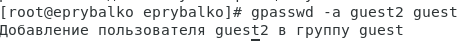
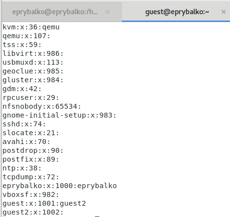

---
## Front matter
lang: ru-RU
title: "Лабораторная работа №3"
subtitle: "Дискреционное разграничение прав в Linux. Два пользователя"
author: |
    Рыбалко Элина\inst{1}

institute: |
	\inst{1}RUDN University, Moscow, Russian Federation
  
date: 2022, 20 September, 2022 Moscow, Russian Federation  

## Formatting
toc: false
slide_level: 2
theme: metropolis
header-includes: 
 - \metroset{progressbar=frametitle,sectionpage=progressbar,numbering=fraction}
 - '\makeatletter'
 - '\beamer@ignorenonframefalse'
 - '\makeatother'
aspectratio: 43
section-titles: true
---

# Прагматика выполнения лабораторной работы 

 - Приобретение практических навыков работы с атрибутами и дискреционным разграничением прав на операционной системе Linux.

# Цель выполнения лабораторной работы

 Получение практических навыков работы в консоли с атрибутами файлов для групп пользователей.

# Задачи выполнения лабораторной работы

- Создать две учётные записи и задать пароль.

- Осуществить вход от двух пользователей, изучить директории, группы, права и атрибуты.

- Выполнить регистрацию пользователя в группе и изменить права директории.

- Заполнить таблицы прав и атрибутов.

# Результаты выполнения лабораторной работы
 
{ #fig:001 width=70% }

{ #fig:002 width=70% } 

# Результаты выполнения лабораторной работы

{ #fig:003 width=70% } 

# Результаты выполнения лабораторной работы

{ #fig:004 width=70% } 

# Результаты выполнения лабораторной работы 

{ #fig:005 width=70% } 

{ #fig:006 width=70% } 

{ #fig:007 width=70% } 

# Результаты выполнения лабораторной работы

{ #fig:008}

# Результаты выполнения лабораторной работы

{ #fig:009} 

# Вывод

Приобрели практические навыки работы в консоли с атрибутами файлов для групп пользователей. 
