---
# Front matter
lang: ru-RU  
title: "Отчёт по лабораторной работе №3. Дискреционное разграничение прав в Linux. Два пользователя"  
subtitle: "дисциплина: Информационная безопасность"  
author: "Рыбалко Элина Павловна"  
teacher: "Дмитрий Сергеевич Кулябов"

# Generic otions
lang: ru-RU
toc-title: "Содержание"

# Bibliography
bibliography: bib/cite.bib
csl: pandoc/csl/gost-r-7-0-5-2008-numeric.csl

# Pdf output format
toc: true # Table of contents
toc_depth: 2
lof: true # List of figures
lot: true # List of tables
fontsize: 12pt
linestretch: 1.5
papersize: a4
documentclass: scrreprt
## I18n
polyglossia-lang:
  name: russian
  options:
  - spelling=modern
  - babelshorthands=true
polyglossia-otherlangs:
  name: english
### Fonts
mainfont: PT Serif
romanfont: PT Serif
sansfont: PT Sans
monofont: PT Mono
mainfontoptions: Ligatures=TeX
romanfontoptions: Ligatures=TeX
sansfontoptions: Ligatures=TeX,Scale=MatchLowercase
monofontoptions: Scale=MatchLowercase,Scale=0.9
## Biblatex
biblatex: true
biblio-style: "gost-numeric"
biblatexoptions:
  - parentracker=true
  - backend=biber
  - hyperref=auto
  - language=auto
  - autolang=other*
  - citestyle=gost-numeric
## Misc options
indent: true
header-includes:
  - \linepenalty=10 # the penalty added to the badness of each line within a paragraph (no associated penalty node) Increasing the value makes tex try to have fewer lines in the paragraph.
  - \interlinepenalty=0 # value of the penalty (node) added after each line of a paragraph.
  - \hyphenpenalty=50 # the penalty for line breaking at an automatically inserted hyphen
  - \exhyphenpenalty=50 # the penalty for line breaking at an explicit hyphen
  - \binoppenalty=700 # the penalty for breaking a line at a binary operator
  - \relpenalty=500 # the penalty for breaking a line at a relation
  - \clubpenalty=150 # extra penalty for breaking after first line of a paragraph
  - \widowpenalty=150 # extra penalty for breaking before last line of a paragraph
  - \displaywidowpenalty=50 # extra penalty for breaking before last line before a display math
  - \brokenpenalty=100 # extra penalty for page breaking after a hyphenated line
  - \predisplaypenalty=10000 # penalty for breaking before a display
  - \postdisplaypenalty=0 # penalty for breaking after a display
  - \floatingpenalty = 20000 # penalty for splitting an insertion (can only be split footnote in standard LaTeX)
  - \raggedbottom # or \flushbottom
  - \usepackage{float} # keep figures where there are in the text
  - \floatplacement{figure}{H} # keep figures where there are in the text
---

# Цель работы

Получение практических навыков работы в консоли с атрибутами файлов для групп пользователей.

#  Техническое обеспечение
Лабораторная работа подразумевает наличие на виртуальной машине VirtualBox операционной системы Linux (дистрибутив Rocky или CentOS).
Выполнение работы возможно как в дисплейном классе факультета физико-математических и естественных наук РУДН, так и дома. Описание выполнения работы приведено для дисплейного класса со следующими характеристиками:
– Intel Core i3-550 3.2 GHz, 4 GB оперативной памяти, 20 GB свободного
места на жёстком диске;
– ОС Linux Gentoo (http://www.gentoo.ru/);
– VirtualBox верс. 6.1 или старше;
– каталог с образами ОС для работающих в дисплейном классе: /afs/dk.sci.pfu.edu.ru/common/files/iso/.
  

# Объект/Предмет исследования

Операционная система Linux.

# Теоретическое введение

В Linux, как и в любой многопользовательской системе, абсолютно естественным образом возникает задача разграничения доступа субъектов — пользователей к объектам — файлам дерева каталогов.

Один из подходов к разграничению доступа — так называемый дискреционный (от англ, discretion — чье-либо усмотрение) — предполагает назначение владельцев объектов, которые по собственному усмотрению определяют права доступа субъектов (других пользователей) к объектам (файлам), которыми владеют.

Дискреционные механизмы разграничения доступа используются для разграничения прав доступа процессов как обычных пользователей, так и для ограничения прав системных программ в (например, служб операционной системы), которые работают от лица псевдопользовательских учетных записей.  [[2]](#список-литературы).

# Выполнение лабораторной работы

1. В установленной при выполнении предыдущей лабораторной работы операционной системе создайте учётную запись пользователя guest (использую учётную запись администратора) (см. рис. -@fig:001).

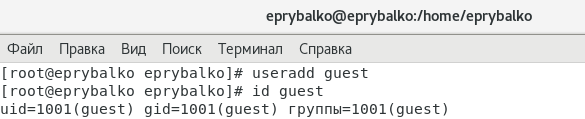{ #fig:001 width=70% } 

2. Задайте пароль для пользователя guest (использую учётную запись администратора) (см. рис. -@fig:002).

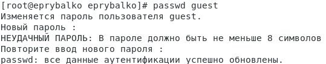{ #fig:002 width=70% } 

3. Аналогично создайте второго пользователя guest2.

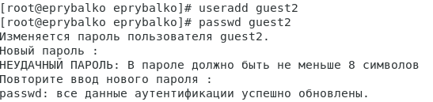{ #fig:003 width=70% }

4. Добавьте пользователя guest2 в группу guest (см. рис. -@fig:004).

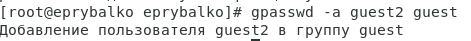{ #fig:004 width=70% } 

5. Осуществите вход в систему от двух пользователей на двух разных консолях: guest на первой консоли и guest2 на второй консоли.

6. Для обоих пользователей командой pwd определите директорию, в которой вы находитесь. Сравните её с приглашениями командной строки (см. рис. -@fig:005, -@fig:006).

  С приглашениями командной строки директории совпадают.

7. Уточните имя вашего пользователя, его группу, кто входит в неё и к каким группам принадлежит он сам. Определите командами groups guest и groups guest2, в какие группы входят пользователи guest и guest2. Сравните вывод команды groups с выводом команд id -Gn и id -G (см. рис. -@fig:005, -@fig:006).

    Информация команды groups с выводом команд id -Gn и id -G совпадает.

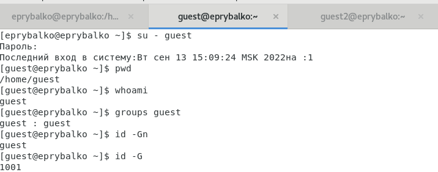{ #fig:005 width=70% } 

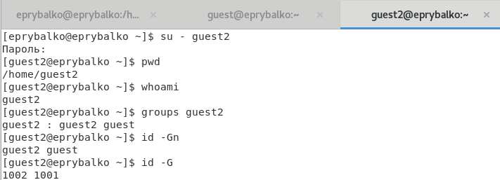{ #fig:006 width=70% }

8. Сравните полученную информацию с содержимым файла /etc/group. Просмотрите файл командой (см. рис. -@fig:007). 

   Информация совпадает. 

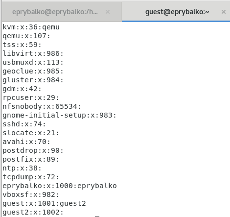{ #fig:007 width=70% } 

9. От имени пользователя guest2 выполните регистрацию пользователя guest2 в группе guest командой newgrp guest (см. рис. -@fig:008).

{ #fig:008 width=70% } 

10. От имени пользователя guest измените права директории /home/guest,
разрешив все действия для пользователей группы: chmod g+rwx /home/guest (см. рис. -@fig:009).

{ #fig:009 width=70% } 

11. От имени пользователя guest снимите с директории /home/guest/dir1 все атрибуты командой chmod 000 dirl и проверьте правильность снятия атрибутов с помощью правильность выполнения команды ls -l (см. рис. -@fig:010).

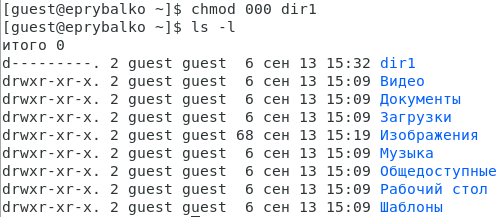{ #fig:010 width=70% } 

12. Меняя атрибуты у директории dir1 и файла file1 от имени пользователя guest и делая проверку от пользователя guest2, заполните табл. 3.1, определив опытным путём, какие операции разрешены, а какие нет. Если операция разрешена, занесите в таблицу знак «+», если не разрешена, знак «-».

Сравните табл. 2.1 (из лабораторной работы № 2) и табл. 3.1. На основании заполненной таблицы определите те или иные минимально необходимые права для выполнения пользователем guest2 операций внутри директории dir1 и заполните табл. 3.2  (см. рис. -@fig:011, рис. -@fig:012, рис. -@fig:013 и рис. -@fig:014).

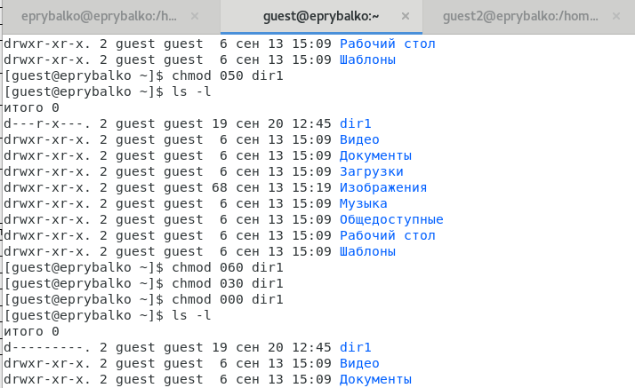{ #fig:011}

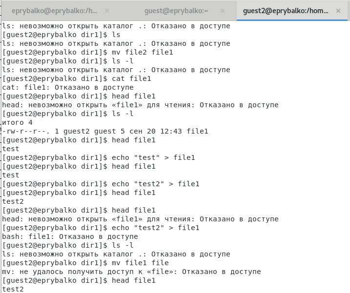{ #fig:012} 

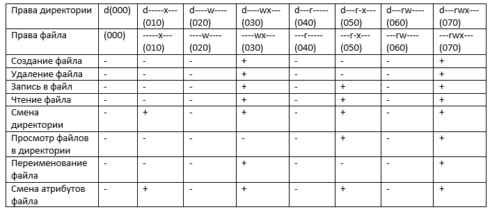{ #fig:013}

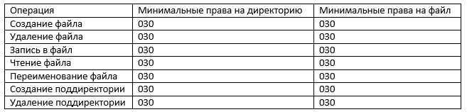{ #fig:014} 

# Вывод

Приобрели практические навыки работы в консоли с атрибутами файлов для групп пользователей. 

# Список литературы {.unnumbered}

1. [Лабораторная работа №3](https://docs.yandex.ru/docs/view?tm=1663623817&tld=ru&lang=ru&name=003-lab_discret_2users.pdf&text=Лабораторная%20работа%20№%203.%20Дискреционное%20разграничение%20прав%20в%20Linux.%20Два%20пользователя%203.1.%20Цель%20работы%20Получение%20практических%20навыков%20работы%20в%20консоли%20с%20атрибутами%20файлов%20для%20групп%20пользователей1%20.%203.2.%20Порядок%20выполнения%20работы%201.%20В%20установленной%20операционной%20системе%20создайте%20учётную%20запись%20пользователя%20guest%20(использую%20учётную%20запись%20администратора)%3A%20useradd%20guest%202.%20Задайте%20пароль%20для%20пользовател&url=https%3A%2F%2Fstud-sci.rudn.ru%2Fpluginfile.php%2F3383%2Fmod_resource%2Fcontent%2F3%2F003-lab_discret_2users.pdf&lr=10668&mime=pdf&l10n=ru&sign=aa76d2c3915d1c17ee6b7a15155cd77d&keyno=0&serpParams=tm%3D1663623817%26tld%3Dru%26lang%3Dru%26name%3D003-lab_discret_2users.pdf%26text%3D%25D0%259B%25D0%25B0%25D0%25B1%25D0%25BE%25D1%2580%25D0%25B0%25D1%2582%25D0%25BE%25D1%2580%25D0%25BD%25D0%25B0%25D1%258F%2B%25D1%2580%25D0%25B0%25D0%25B1%25D0%25BE%25D1%2582%25D0%25B0%2B%25E2%2584%2596%2B3.%2B%25D0%2594%25D0%25B8%25D1%2581%25D0%25BA%25D1%2580%25D0%25B5%25D1%2586%25D0%25B8%25D0%25BE%25D0%25BD%25D0%25BD%25D0%25BE%25D0%25B5%2B%25D1%2580%25D0%25B0%25D0%25B7%25D0%25B3%25D1%2580%25D0%25B0%25D0%25BD%25D0%25B8%25D1%2587%25D0%25B5%25D0%25BD%25D0%25B8%25D0%25B5%2B%25D0%25BF%25D1%2580%25D0%25B0%25D0%25B2%2B%25D0%25B2%2BLinux.%2B%25D0%2594%25D0%25B2%25D0%25B0%2B%25D0%25BF%25D0%25BE%25D0%25BB%25D1%258C%25D0%25B7%25D0%25BE%25D0%25B2%25D0%25B0%25D1%2582%25D0%25B5%25D0%25BB%25D1%258F%2B3.1.%2B%25D0%25A6%25D0%25B5%25D0%25BB%25D1%258C%2B%25D1%2580%25D0%25B0%25D0%25B1%25D0%25BE%25D1%2582%25D1%258B%2B%25D0%259F%25D0%25BE%25D0%25BB%25D1%2583%25D1%2587%25D0%25B5%25D0%25BD%25D0%25B8%25D0%25B5%2B%25D0%25BF%25D1%2580%25D0%25B0%25D0%25BA%25D1%2582%25D0%25B8%25D1%2587%25D0%25B5%25D1%2581%25D0%25BA%25D0%25B8%25D1%2585%2B%25D0%25BD%25D0%25B0%25D0%25B2%25D1%258B%25D0%25BA%25D0%25BE%25D0%25B2%2B%25D1%2580%25D0%25B0%25D0%25B1%25D0%25BE%25D1%2582%25D1%258B%2B%25D0%25B2%2B%25D0%25BA%25D0%25BE%25D0%25BD%25D1%2581%25D0%25BE%25D0%25BB%25D0%25B8%2B%25D1%2581%2B%25D0%25B0%25D1%2582%25D1%2580%25D0%25B8%25D0%25B1%25D1%2583%25D1%2582%25D0%25B0%25D0%25BC%25D0%25B8%2B%25D1%2584%25D0%25B0%25D0%25B9%25D0%25BB%25D0%25BE%25D0%25B2%2B%25D0%25B4%25D0%25BB%25D1%258F%2B%25D0%25B3%25D1%2580%25D1%2583%25D0%25BF%25D0%25BF%2B%25D0%25BF%25D0%25BE%25D0%25BB%25D1%258C%25D0%25B7%25D0%25BE%25D0%25B2%25D0%25B0%25D1%2582%25D0%25B5%25D0%25BB%25D0%25B5%25D0%25B91%2B.%2B3.2.%2B%25D0%259F%25D0%25BE%25D1%2580%25D1%258F%25D0%25B4%25D0%25BE%25D0%25BA%2B%25D0%25B2%25D1%258B%25D0%25BF%25D0%25BE%25D0%25BB%25D0%25BD%25D0%25B5%25D0%25BD%25D0%25B8%25D1%258F%2B%25D1%2580%25D0%25B0%25D0%25B1%25D0%25BE%25D1%2582%25D1%258B%2B1.%2B%25D0%2592%2B%25D1%2583%25D1%2581%25D1%2582%25D0%25B0%25D0%25BD%25D0%25BE%25D0%25B2%25D0%25BB%25D0%25B5%25D0%25BD%25D0%25BD%25D0%25BE%25D0%25B9%2B%25D0%25BE%25D0%25BF%25D0%25B5%25D1%2580%25D0%25B0%25D1%2586%25D0%25B8%25D0%25BE%25D0%25BD%25D0%25BD%25D0%25BE%25D0%25B9%2B%25D1%2581%25D0%25B8%25D1%2581%25D1%2582%25D0%25B5%25D0%25BC%25D0%25B5%2B%25D1%2581%25D0%25BE%25D0%25B7%25D0%25B4%25D0%25B0%25D0%25B9%25D1%2582%25D0%25B5%2B%25D1%2583%25D1%2587%25D1%2591%25D1%2582%25D0%25BD%25D1%2583%25D1%258E%2B%25D0%25B7%25D0%25B0%25D0%25BF%25D0%25B8%25D1%2581%25D1%258C%2B%25D0%25BF%25D0%25BE%25D0%25BB%25D1%258C%25D0%25B7%25D0%25BE%25D0%25B2%25D0%25B0%25D1%2582%25D0%25B5%25D0%25BB%25D1%258F%2Bguest%2B%2528%25D0%25B8%25D1%2581%25D0%25BF%25D0%25BE%25D0%25BB%25D1%258C%25D0%25B7%25D1%2583%25D1%258E%2B%25D1%2583%25D1%2587%25D1%2591%25D1%2582%25D0%25BD%25D1%2583%25D1%258E%2B%25D0%25B7%25D0%25B0%25D0%25BF%25D0%25B8%25D1%2581%25D1%258C%2B%25D0%25B0%25D0%25B4%25D0%25BC%25D0%25B8%25D0%25BD%25D0%25B8%25D1%2581%25D1%2582%25D1%2580%25D0%25B0%25D1%2582%25D0%25BE%25D1%2580%25D0%25B0%2529%253A%2Buseradd%2Bguest%2B2.%2B%25D0%2597%25D0%25B0%25D0%25B4%25D0%25B0%25D0%25B9%25D1%2582%25D0%25B5%2B%25D0%25BF%25D0%25B0%25D1%2580%25D0%25BE%25D0%25BB%25D1%258C%2B%25D0%25B4%25D0%25BB%25D1%258F%2B%25D0%25BF%25D0%25BE%25D0%25BB%25D1%258C%25D0%25B7%25D0%25BE%25D0%25B2%25D0%25B0%25D1%2582%25D0%25B5%25D0%25BB%26url%3Dhttps%253A%2F%2Fstud-sci.rudn.ru%2Fpluginfile.php%2F3383%2Fmod_resource%2Fcontent%2F3%2F003-lab_discret_2users.pdf%26lr%3D10668%26mime%3Dpdf%26l10n%3Dru%26sign%3Daa76d2c3915d1c17ee6b7a15155cd77d%26keyno%3D0)
2. [Дискреционное разграничение доступа Linux](https://debianinstall.ru/diskretsionnoe-razgranichenie-dostupa-linux/)
3. [Руководство по формуле Cmd Markdown](https://russianblogs.com/article/26051452570/)
4. [Руководство по оформлению Markdown файлов](https://gist.github.com/Jekins/2bf2d0638163f1294637)