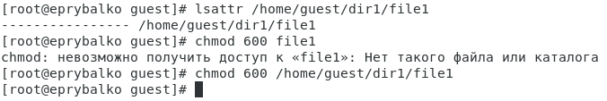
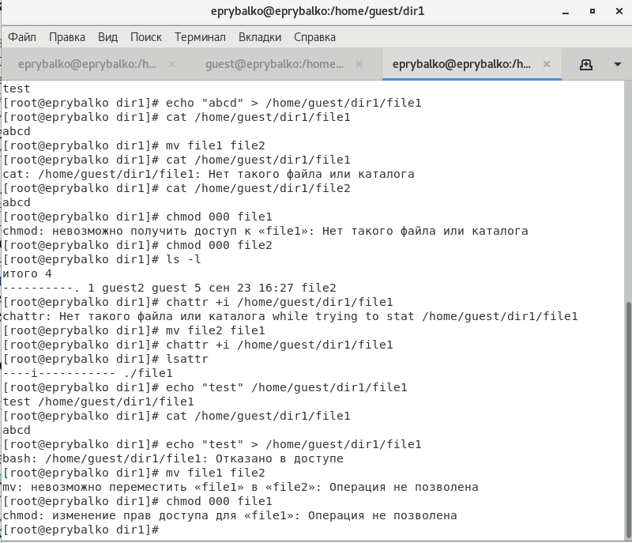

---
## Front matter
lang: ru-RU
title: "Лабораторная работа №4"
subtitle: "Дискреционное разграничение прав в Linux. Расширенные атрибуты"
author: |
    Рыбалко Элина\inst{1}

institute: |
	\inst{1}RUDN University, Moscow, Russian Federation
  
date: 2022, 26 September, 2022 Moscow, Russian Federation  

## Formatting
toc: false
slide_level: 2
theme: metropolis
header-includes: 
 - \metroset{progressbar=frametitle,sectionpage=progressbar,numbering=fraction}
 - '\makeatletter'
 - '\beamer@ignorenonframefalse'
 - '\makeatother'
aspectratio: 43
section-titles: true
---

# Прагматика выполнения лабораторной работы 

 - Приобретение практических навыков работы с атрибутами и дискреционным разграничением прав на операционной системе Linux.

# Цель выполнения лабораторной работы

 Получение практических навыков работы в консоли  с расширенными атрибутами файлов.

# Задачи выполнения лабораторной работы

- Определить текущие атрибуты.

- Установить расширенный атрибут a.

- Снять атрибут и повторить комады.

- Установить расширенный атрибут i и повторить комады.

# Результаты выполнения лабораторной работы
 
{ #fig:001 width=70% } 

# Результаты выполнения лабораторной работы

{ #fig:002 width=70% }

# Результаты выполнения лабораторной работы

{ #fig:003 width=70% } 

# Результаты выполнения лабораторной работы 

{ #fig:004 width=70% }

# Вывод

Приобрели практические навыки работы в консоли с атрибутами файлов для групп пользователей. 
В результате выполнения работы повысили свои навыки использования интерфейса командой строки (CLI), познакомились на примерах с тем, как используются основные и расширенные атрибуты при разграничении
доступа. Имели возможность связать теорию дискреционного разделения доступа (дискреционная политика безопасности) с её реализацией на практике в ОС Linux. Составили наглядные таблицы, поясняющие какие операции возможны при тех или иных установленных правах. Опробовали действие на практике расширенных атрибутов «а» и «i».
