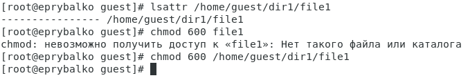
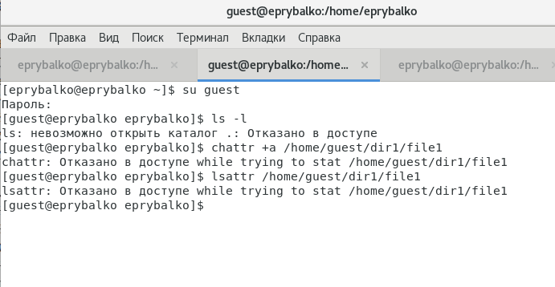
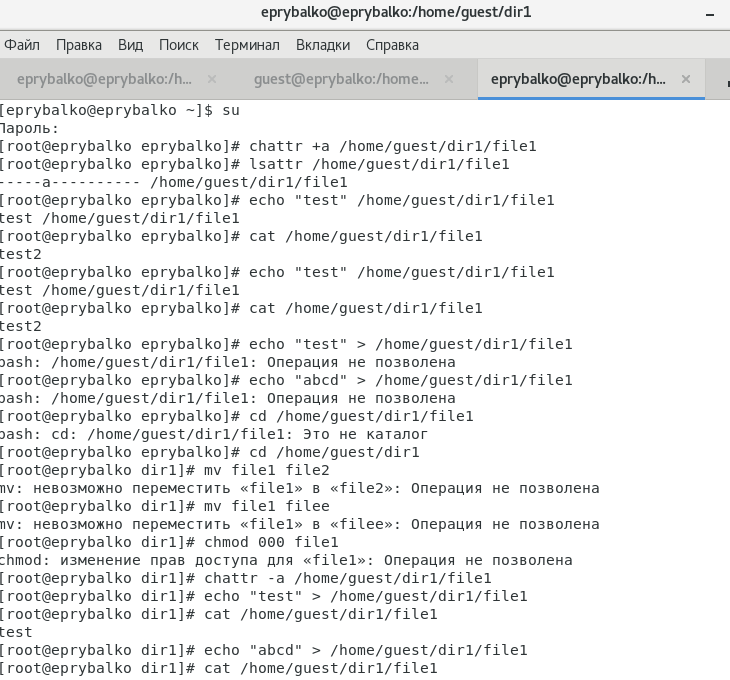
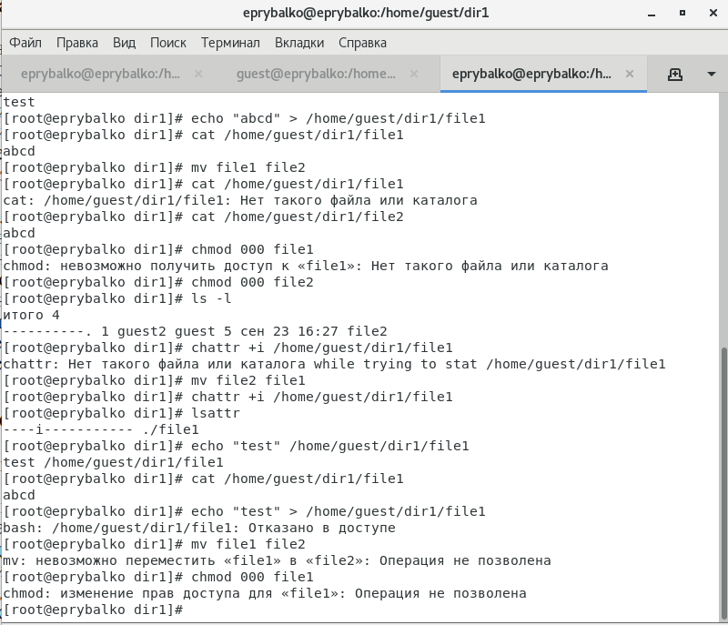

---
# Front matter
lang: ru-RU  
title: "Отчёт по лабораторной работе №4. Дискреционное разграничение прав в Linux. Расширенные атрибуты"  
subtitle: "дисциплина: Информационная безопасность"  
author: "Рыбалко Элина Павловна"  
teacher: "Дмитрий Сергеевич Кулябов"

# Generic otions
lang: ru-RU
toc-title: "Содержание"

# Bibliography
bibliography: bib/cite.bib
csl: pandoc/csl/gost-r-7-0-5-2008-numeric.csl

# Pdf output format
toc: true # Table of contents
toc_depth: 2
lof: true # List of figures
lot: true # List of tables
fontsize: 12pt
linestretch: 1.5
papersize: a4
documentclass: scrreprt
## I18n
polyglossia-lang:
  name: russian
  options:
  - spelling=modern
  - babelshorthands=true
polyglossia-otherlangs:
  name: english
### Fonts
mainfont: PT Serif
romanfont: PT Serif
sansfont: PT Sans
monofont: PT Mono
mainfontoptions: Ligatures=TeX
romanfontoptions: Ligatures=TeX
sansfontoptions: Ligatures=TeX,Scale=MatchLowercase
monofontoptions: Scale=MatchLowercase,Scale=0.9
## Biblatex
biblatex: true
biblio-style: "gost-numeric"
biblatexoptions:
  - parentracker=true
  - backend=biber
  - hyperref=auto
  - language=auto
  - autolang=other*
  - citestyle=gost-numeric
## Misc options
indent: true
header-includes:
  - \linepenalty=10 # the penalty added to the badness of each line within a paragraph (no associated penalty node) Increasing the value makes tex try to have fewer lines in the paragraph.
  - \interlinepenalty=0 # value of the penalty (node) added after each line of a paragraph.
  - \hyphenpenalty=50 # the penalty for line breaking at an automatically inserted hyphen
  - \exhyphenpenalty=50 # the penalty for line breaking at an explicit hyphen
  - \binoppenalty=700 # the penalty for breaking a line at a binary operator
  - \relpenalty=500 # the penalty for breaking a line at a relation
  - \clubpenalty=150 # extra penalty for breaking after first line of a paragraph
  - \widowpenalty=150 # extra penalty for breaking before last line of a paragraph
  - \displaywidowpenalty=50 # extra penalty for breaking before last line before a display math
  - \brokenpenalty=100 # extra penalty for page breaking after a hyphenated line
  - \predisplaypenalty=10000 # penalty for breaking before a display
  - \postdisplaypenalty=0 # penalty for breaking after a display
  - \floatingpenalty = 20000 # penalty for splitting an insertion (can only be split footnote in standard LaTeX)
  - \raggedbottom # or \flushbottom
  - \usepackage{float} # keep figures where there are in the text
  - \floatplacement{figure}{H} # keep figures where there are in the text
---

# Цель работы

  Получение практических навыков работы в консоли с расширенными атрибутами файлов.

#  Техническое обеспечение
  
  Лабораторная работа подразумевает наличие на виртуальной машине VirtualBox операционной системы Linux (дистрибутив Rocky или CentOS).
  Выполнение работы возможно как в дисплейном классе факультета физико-математических и естественных наук РУДН, так и дома. Описание выполнения работы приведено для дисплейного класса со следующими характеристиками:
  – Intel Core i3-550 3.2 GHz, 4 GB оперативной памяти, 20 GB свободного
  места на жёстком диске;
  – ОС Linux Gentoo (http://www.gentoo.ru/);
  – VirtualBox верс. 6.1 или старше;
  – каталог с образами ОС для работающих в дисплейном классе: /afs/dk.sci.pfu.edu.ru/common/files/iso/.
    

# Объект/Предмет исследования

  Операционная система Linux и расширенные атрибуты.

# Теоретическое введение

    В Linux, как и в любой многопользовательской системе, абсолютно естественным образом возникает задача разграничения доступа субъектов — пользователей к объектам — файлам дерева каталогов.

  Один из подходов к разграничению доступа — так называемый дискреционный (от англ, discretion — чье-либо усмотрение) — предполагает назначение владельцев объектов, которые по собственному усмотрению определяют права доступа субъектов (других пользователей) к объектам (файлам), которыми владеют.

  Дискреционные механизмы разграничения доступа используются для разграничения прав доступа процессов как обычных пользователей, так и для ограничения прав системных программ в (например, служб операционной системы), которые работают от лица псевдопользовательских учетных записей.  [[2]](#список-литературы).

# Выполнение лабораторной работы

  1. От имени пользователя guest определите расширенные атрибуты файла
  /home/guest/dir1/file1 командой lsattr /home/guest/dir1/file1 (см. рис. -@fig:001).

  2. Установите командой chmod 600 file1 на файл file1 права, разрешающие чтение и запись для владельца файла (см. рис. -@fig:001).

  { #fig:001 width=70% } 

  3. Попробуйте установить на файл /home/guest/dir1/file1 расширенный атрибут a от имени пользователя guest: chattr +a /home/guest/dir1/file1. В ответ получили отказ от выполнения операции (см. рис. -@fig:002). 

  { #fig:002 width=70% }

  4. Зайдите на третью консоль с правами администратора либо повысьте свои права с помощью команды su. Попробуйте установить расширенный атрибут a на файл /home/guest/dir1/file1 от имени суперпользователя:
  chattr +a /home/guest/dir1/file1 (см. рис. -@fig:003).

  5. От пользователя guest проверьте правильность установления атрибута:
  lsattr /home/guest/dir1/file1 (см. рис. -@fig:003).

  6. Выполните дозапись в файл file1 слова «test» командой echo "test" /home/guest/dir1/file1
  После этого выполните чтение файла file1 командой cat /home/guest/dir1/file1 (см. рис. -@fig:003).

  7. Попробуйте удалить файл file1 либо стереть имеющуюся в нём информацию командой echo "abcd" > /home/guest/dirl/file1. Попробуйте переименовать файл. (см. рис. -@fig:003).
    Не вышло.

  8. Попробуйте с помощью команды chmod 000 file1 установить на файл file1 права, например, запрещающие чтение и запись для владельца файла (см. рис. -@fig:003).
  Удалось ли вам успешно выполнить указанные команды?
    Не удалось. 

  9. Снимите расширенный атрибут a с файла /home/guest/dirl/file1 от имени суперпользователя командой chattr -a /home/guest/dir1/file1 (см. рис. -@fig:003).
  Повторите операции, которые вам ранее не удавалось выполнить (см. рис. -@fig:003 и рис. -@fig:004).

  10. Повторите ваши действия по шагам, заменив атрибут «a» атрибутом «i». Удалось ли вам дозаписать информацию в файл? (см. рис. -@fig:004).
    Не удалось.

  { #fig:003 width=70% } 

  { #fig:004 width=70% }

# Вывод

  Приобрели практические навыки работы в консоли с расширенными атрибутами. 

  В результате выполнения работы повысили свои навыки использования интерфейса командой строки (CLI), познакомились на примерах с тем, как используются основные и расширенные атрибуты при разграничении
  доступа. Имели возможность связать теорию дискреционного разделения доступа (дискреционная политика безопасности) с её реализацией на практике в ОС Linux. Составили наглядные таблицы, поясняющие какие операции возможны при тех или иных установленных правах. Опробовали действие на практике расширенных атрибутов «а» и «i».

# Список литературы {.unnumbered}

1. [Лабораторная работа №4](https://docs.yandex.ru/docs/view?tm=1664137330&tld=ru&lang=ru&name=004-lab_discret_extattr.pdf&text=Лабораторная%20работа%20№%204.%20Дискреционное%20разграничение%20прав%20в%20Linux.%20Расширенные%20атрибуты%204.1.%20Цель%20работы%20Получение%20практических%20навыков%20работы%20в%20консоли%20с%20расширенными%20атрибутами%20файлов1%20.%204.2.%20Порядок%20выполнения%20работы%201.%20От%20имени%20пользователя%20guest%20определите%20расширенные%20атрибуты%20файла%20%2Fhome%2Fguest%2Fdir1%2Ffile1%20командой%20lsattr%20%2Fhome%2Fguest%2Fdir1%2Ffile1%202.%20Установите%20командой%20chmod%20600%20file1%20на%20файл%20fi&url=https%3A%2F%2Fstud-sci.rudn.ru%2Fpluginfile.php%2F3994%2Fmod_resource%2Fcontent%2F2%2F004-lab_discret_extattr.pdf&lr=213&mime=pdf&l10n=ru&sign=cbb6886a6b3e5a1af5d0c3b2cd952019&keyno=0&serpParams=tm%3D1664137330%26tld%3Dru%26lang%3Dru%26name%3D004-lab_discret_extattr.pdf%26text%3D%25D0%259B%25D0%25B0%25D0%25B1%25D0%25BE%25D1%2580%25D0%25B0%25D1%2582%25D0%25BE%25D1%2580%25D0%25BD%25D0%25B0%25D1%258F%2B%25D1%2580%25D0%25B0%25D0%25B1%25D0%25BE%25D1%2582%25D0%25B0%2B%25E2%2584%2596%2B4.%2B%25D0%2594%25D0%25B8%25D1%2581%25D0%25BA%25D1%2580%25D0%25B5%25D1%2586%25D0%25B8%25D0%25BE%25D0%25BD%25D0%25BD%25D0%25BE%25D0%25B5%2B%25D1%2580%25D0%25B0%25D0%25B7%25D0%25B3%25D1%2580%25D0%25B0%25D0%25BD%25D0%25B8%25D1%2587%25D0%25B5%25D0%25BD%25D0%25B8%25D0%25B5%2B%25D0%25BF%25D1%2580%25D0%25B0%25D0%25B2%2B%25D0%25B2%2BLinux.%2B%25D0%25A0%25D0%25B0%25D1%2581%25D1%2588%25D0%25B8%25D1%2580%25D0%25B5%25D0%25BD%25D0%25BD%25D1%258B%25D0%25B5%2B%25D0%25B0%25D1%2582%25D1%2580%25D0%25B8%25D0%25B1%25D1%2583%25D1%2582%25D1%258B%2B4.1.%2B%25D0%25A6%25D0%25B5%25D0%25BB%25D1%258C%2B%25D1%2580%25D0%25B0%25D0%25B1%25D0%25BE%25D1%2582%25D1%258B%2B%25D0%259F%25D0%25BE%25D0%25BB%25D1%2583%25D1%2587%25D0%25B5%25D0%25BD%25D0%25B8%25D0%25B5%2B%25D0%25BF%25D1%2580%25D0%25B0%25D0%25BA%25D1%2582%25D0%25B8%25D1%2587%25D0%25B5%25D1%2581%25D0%25BA%25D0%25B8%25D1%2585%2B%25D0%25BD%25D0%25B0%25D0%25B2%25D1%258B%25D0%25BA%25D0%25BE%25D0%25B2%2B%25D1%2580%25D0%25B0%25D0%25B1%25D0%25BE%25D1%2582%25D1%258B%2B%25D0%25B2%2B%25D0%25BA%25D0%25BE%25D0%25BD%25D1%2581%25D0%25BE%25D0%25BB%25D0%25B8%2B%25D1%2581%2B%25D1%2580%25D0%25B0%25D1%2581%25D1%2588%25D0%25B8%25D1%2580%25D0%25B5%25D0%25BD%25D0%25BD%25D1%258B%25D0%25BC%25D0%25B8%2B%25D0%25B0%25D1%2582%25D1%2580%25D0%25B8%25D0%25B1%25D1%2583%25D1%2582%25D0%25B0%25D0%25BC%25D0%25B8%2B%25D1%2584%25D0%25B0%25D0%25B9%25D0%25BB%25D0%25BE%25D0%25B21%2B.%2B4.2.%2B%25D0%259F%25D0%25BE%25D1%2580%25D1%258F%25D0%25B4%25D0%25BE%25D0%25BA%2B%25D0%25B2%25D1%258B%25D0%25BF%25D0%25BE%25D0%25BB%25D0%25BD%25D0%25B5%25D0%25BD%25D0%25B8%25D1%258F%2B%25D1%2580%25D0%25B0%25D0%25B1%25D0%25BE%25D1%2582%25D1%258B%2B1.%2B%25D0%259E%25D1%2582%2B%25D0%25B8%25D0%25BC%25D0%25B5%25D0%25BD%25D0%25B8%2B%25D0%25BF%25D0%25BE%25D0%25BB%25D1%258C%25D0%25B7%25D0%25BE%25D0%25B2%25D0%25B0%25D1%2582%25D0%25B5%25D0%25BB%25D1%258F%2Bguest%2B%25D0%25BE%25D0%25BF%25D1%2580%25D0%25B5%25D0%25B4%25D0%25B5%25D0%25BB%25D0%25B8%25D1%2582%25D0%25B5%2B%25D1%2580%25D0%25B0%25D1%2581%25D1%2588%25D0%25B8%25D1%2580%25D0%25B5%25D0%25BD%25D0%25BD%25D1%258B%25D0%25B5%2B%25D0%25B0%25D1%2582%25D1%2580%25D0%25B8%25D0%25B1%25D1%2583%25D1%2582%25D1%258B%2B%25D1%2584%25D0%25B0%25D0%25B9%25D0%25BB%25D0%25B0%2B%2Fhome%2Fguest%2Fdir1%2Ffile1%2B%25D0%25BA%25D0%25BE%25D0%25BC%25D0%25B0%25D0%25BD%25D0%25B4%25D0%25BE%25D0%25B9%2Blsattr%2B%2Fhome%2Fguest%2Fdir1%2Ffile1%2B2.%2B%25D0%25A3%25D1%2581%25D1%2582%25D0%25B0%25D0%25BD%25D0%25BE%25D0%25B2%25D0%25B8%25D1%2582%25D0%25B5%2B%25D0%25BA%25D0%25BE%25D0%25BC%25D0%25B0%25D0%25BD%25D0%25B4%25D0%25BE%25D0%25B9%2Bchmod%2B600%2Bfile1%2B%25D0%25BD%25D0%25B0%2B%25D1%2584%25D0%25B0%25D0%25B9%25D0%25BB%2Bfi%26url%3Dhttps%253A%2F%2Fstud-sci.rudn.ru%2Fpluginfile.php%2F3994%2Fmod_resource%2Fcontent%2F2%2F004-lab_discret_extattr.pdf%26lr%3D213%26mime%3Dpdf%26l10n%3Dru%26sign%3Dcbb6886a6b3e5a1af5d0c3b2cd952019%26keyno%3D0)
2. [Дискреционное разграничение доступа Linux](https://debianinstall.ru/diskretsionnoe-razgranichenie-dostupa-linux/)
3. [Руководство по формуле Cmd Markdown](https://russianblogs.com/article/26051452570/)
4. [Руководство по оформлению Markdown файлов](https://gist.github.com/Jekins/2bf2d0638163f1294637)