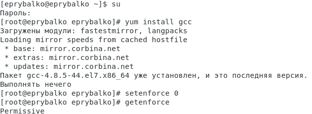

---
## Front matter
lang: ru-RU
title: "Лабораторная работа №5"
subtitle: "Дискреционное разграничение прав в Linux. Исследование влияния дополнительных атрибутов"
author: |
    Рыбалко Элина\inst{1}

institute: |
	\inst{1}RUDN University, Moscow, Russian Federation
  
date: 2022, 03 September, 2022 Moscow, Russian Federation  

## Formatting
toc: false
slide_level: 2
theme: metropolis
header-includes: 
 - \metroset{progressbar=frametitle,sectionpage=progressbar,numbering=fraction}
 - '\makeatletter'
 - '\beamer@ignorenonframefalse'
 - '\makeatother'
aspectratio: 43
section-titles: true
---

# Прагматика выполнения лабораторной работы 

 - Приобретение практических навыков работы с атрибутами, дискреционным разграничением прав и механизмами изменения идентификаторов на операционной системы Linux.

# Цель выполнения лабораторной работы

 Изучить механизмы изменения идентификаторов, применения SetUID- и Sticky-битов. Получение практических навыков работы в консоли с дополнительными атрибутами. Рассмотрение работы механизма смены идентификатора процессов пользователей, а также влияние бита Sticky на запись и удаление файлов.

# Задачи выполнения лабораторной работы

- Подготовка лабораторного стенда.

- Создание и компиляция программы.

- Исследование Sticky-бита.

# Результаты выполнения лабораторной работы
 
{ #fig:001 width=70% }

# Результаты выполнения лабораторной работы

{ #fig:002 width=70% } 

# Результаты выполнения лабораторной работы

{ #fig:003 width=70% } 

# Результаты выполнения лабораторной работы

{ #fig:004 width=70% }

# Результаты выполнения лабораторной работы 

{ #fig:005 width=70% }

# Результаты выполнения лабораторной работы 

{ #fig:006 width=70% }

# Результаты выполнения лабораторной работы 

{ #fig:007 width=70% }

# Результаты выполнения лабораторной работы 

{ #fig:008 width=70% }

# Вывод

 Изучили механизмы изменения идентификаторов, применения SetUID- и Sticky-битов. Получили практические навыки работы в консоли с дополнительными атрибутами. Рассмотрели работу механизма смены идентификатора процессов пользователей, а также влияние бита Sticky на запись и удаление файлов.
