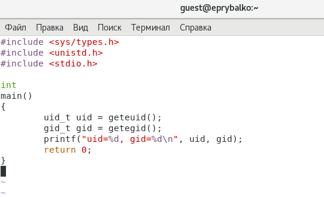
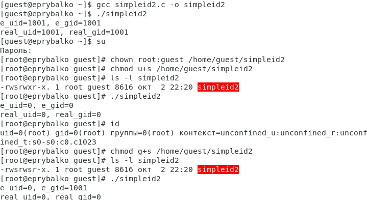
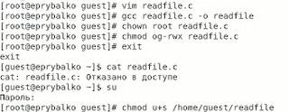
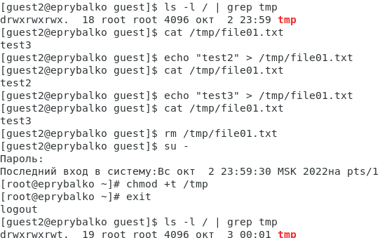

---
# Front matter
lang: ru-RU  
title: "Отчёт по лабораторной работе №5. Дискреционное разграничение прав в Linux. Исследование
влияния дополнительных атрибутов"  
subtitle: "дисциплина: Информационная безопасность"  
author: "Рыбалко Элина Павловна"  
teacher: "Дмитрий Сергеевич Кулябов"

# Generic otions
lang: ru-RU
toc-title: "Содержание"

# Bibliography
bibliography: bib/cite.bib
csl: pandoc/csl/gost-r-7-0-5-2008-numeric.csl

# Pdf output format
toc: true # Table of contents
toc_depth: 2
lof: true # List of figures
lot: true # List of tables
fontsize: 12pt
linestretch: 1.5
papersize: a4
documentclass: scrreprt
## I18n
polyglossia-lang:
  name: russian
  options:
  - spelling=modern
  - babelshorthands=true
polyglossia-otherlangs:
  name: english
### Fonts
mainfont: PT Serif
romanfont: PT Serif
sansfont: PT Sans
monofont: PT Mono
mainfontoptions: Ligatures=TeX
romanfontoptions: Ligatures=TeX
sansfontoptions: Ligatures=TeX,Scale=MatchLowercase
monofontoptions: Scale=MatchLowercase,Scale=0.9
## Biblatex
biblatex: true
biblio-style: "gost-numeric"
biblatexoptions:
  - parentracker=true
  - backend=biber
  - hyperref=auto
  - language=auto
  - autolang=other*
  - citestyle=gost-numeric
## Misc options
indent: true
header-includes:
  - \linepenalty=10 # the penalty added to the badness of each line within a paragraph (no associated penalty node) Increasing the value makes tex try to have fewer lines in the paragraph.
  - \interlinepenalty=0 # value of the penalty (node) added after each line of a paragraph.
  - \hyphenpenalty=50 # the penalty for line breaking at an automatically inserted hyphen
  - \exhyphenpenalty=50 # the penalty for line breaking at an explicit hyphen
  - \binoppenalty=700 # the penalty for breaking a line at a binary operator
  - \relpenalty=500 # the penalty for breaking a line at a relation
  - \clubpenalty=150 # extra penalty for breaking after first line of a paragraph
  - \widowpenalty=150 # extra penalty for breaking before last line of a paragraph
  - \displaywidowpenalty=50 # extra penalty for breaking before last line before a display math
  - \brokenpenalty=100 # extra penalty for page breaking after a hyphenated line
  - \predisplaypenalty=10000 # penalty for breaking before a display
  - \postdisplaypenalty=0 # penalty for breaking after a display
  - \floatingpenalty = 20000 # penalty for splitting an insertion (can only be split footnote in standard LaTeX)
  - \raggedbottom # or \flushbottom
  - \usepackage{float} # keep figures where there are in the text
  - \floatplacement{figure}{H} # keep figures where there are in the text
---

# Цель работы

  Изучить механизмы изменения идентификаторов, применения SetUID- и Sticky-битов. Получение практических навыков работы в консоли с дополнительными атрибутами. Рассмотрение работы механизма смены идентификатора процессов пользователей, а также влияние бита Sticky на запись и удаление файлов.

#  Техническое обеспечение
  
  Лабораторная работа подразумевает наличие на виртуальной машине VirtualBox операционной системы Linux (дистрибутив Rocky или CentOS).
  Выполнение работы возможно как в дисплейном классе факультета физико-математических и естественных наук РУДН, так и дома. Описание выполнения работы приведено для дисплейного класса со следующими характеристиками:
  – Intel Core i3-550 3.2 GHz, 4 GB оперативной памяти, 20 GB свободного
  места на жёстком диске;
  – ОС Linux Gentoo (http://www.gentoo.ru/);
  – VirtualBox верс. 6.1 или старше;
  – каталог с образами ОС для работающих в дисплейном классе: /afs/dk.sci.pfu.edu.ru/common/files/iso/.
    

# Объект/Предмет исследования

  Операционная система Linux и расширенные атрибуты.

# Теоретическое введение

  В Linux, как и в любой многопользовательской системе, абсолютно естественным образом возникает задача разграничения доступа субъектов — пользователей к объектам — файлам дерева каталогов.

  Один из подходов к разграничению доступа — так называемый дискреционный (от англ, discretion — чье-либо усмотрение) — предполагает назначение владельцев объектов, которые по собственному усмотрению определяют права доступа субъектов (других пользователей) к объектам (файлам), которыми владеют.

  Дискреционные механизмы разграничения доступа используются для разграничения прав доступа процессов как обычных пользователей, так и для ограничения прав системных программ в (например, служб операционной системы), которые работают от лица псевдопользовательских учетных записей.  [[2]](#список-литературы).

# Выполнение лабораторной работы

## 1. Подготовка лабораторного стенда

  1. Убедиться, что в системе установлен компилятор gcc (см. рис. -@fig:001).

  2. Отключите систему запретов до очередной перезагрузки системы командой setenforce 0. После этого команда getenforce должна выводить Permissive (см. рис. -@fig:001).

  { #fig:001 width=70% }

## 2. Создание программы

  1. Войдите в систему от имени пользователя guest (см. рис. -@fig:002).

  2. Создайте программу simpleid.c (см. рис. -@fig:002).

  { #fig:002 width=70% } 

  3. Скомплилируйте программу и убедитесь, что файл программы создан: gcc simpleid.c -o simpleid (см. рис. -@fig:003). 

  4. Выполните программу simpleid: ./simpleid (см. рис. -@fig:003).

  5. Выполните системную программу id: id и сравните полученный вами результат с данными предыдущего пункта задания (см. рис. -@fig:003).

  Результаты совпадают.

  { #fig:003 width=70% } 

  6. Усложните программу, добавив вывод действительных идентификаторов. Получившуюся программу назовите simpleid2.c (см. рис. -@fig:004 и рис. -@fig:005).

  { #fig:004 width=70% }

  { #fig:005 width=70% }

  7. Скомпилируйте и запустите simpleid2.c (см. рис. -@fig:006).

  8. От имени суперпользователя выполните команды (см. рис. -@fig:006).

  9. Используйте sudo или повысьте временно свои права с помощью su (см. рис. -@fig:006).
    
  Первая команда меняет владельца файла simpleid2 на группу guest. Вторая команда меняет права доступа к файлу simpleid2 для пользователя и установленные атрибуты SUID или SGID позволяют запускать файл на выполнение с правами владельца файла или группы соответственно.

  10. Выполните проверку правильности установки новых атрибутов и смены владельца файла simpleid2 (см. рис. -@fig:006).
  
  11. Запустите simpleid2 и id (см. рис. -@fig:006).

  Результаты совпадают.

  12. Проделайте тоже самое относительно SetGID-бита (см. рис. -@fig:006).

  { #fig:006 width=70% }

  13. Создайте программу readfile.c (см. рис. -@fig:007).

  { #fig:007 width=70% }

  14. Откомпилируйте её (см. рис. -@fig:008).

  15. Смените владельца у файла readfile.c (или любого другого текстового файла в системе) и измените права так, чтобы только суперпользователь (root) мог прочитать его, a guest не мог (см. рис. -@fig:008).

  16. Проверьте, что пользователь guest не может прочитать файл readfile.c (см. рис. -@fig:008).

  17. Смените у программы readfile владельца и установите SetU’D-бит (см. рис. -@fig:008).

  { #fig:008 width=70% }

  18. Проверьте, может ли программа readfile прочитать файл readfile.c (см. рис. -@fig:009).

  { #fig:009 width=70% }
  
  19. Проверьте, может ли программа readfile прочитать файл /etc/shadow (см. рис. -@fig:010).
    
    Программа может прочитать файлы.

  { #fig:010 width=70% }

## 3. Исследование Sticky-бита

  1. Выясните, установлен ли атрибут Sticky на директории /tmp, для чего выполните команду ls -l / | grep tmp (см. рис. -@fig:011).
  
  2. От имени пользователя guest создайте файл file01.txt в директории /tmp со словом test (см. рис. -@fig:011).
  
  3. Просмотрите атрибуты у только что созданного файла и разрешите чтение и запись для категории пользователей «все остальные» (см. рис. -@fig:011).
  
  4. От пользователя guest2 (не являющегося владельцем) попробуйте прочитать файл /tmp/file01.txt (см. рис. -@fig:011).
  
  5. От пользователя guest2 попробуйте дозаписать в файл (см. рис. -@fig:011).

  Выполнить операцию удалось.
    
  6. Проверьте содержимое файла командой cat /tmp/file01.txt (см. рис. -@fig:011).
  
  7. От пользователя guest2 попробуйте записать в файл /tmp/file01.txt слово test3, стерев при этом всю имеющуюся в файле информацию командой echo "test3" > /tmp/file01.txt (см. рис. -@fig:011).
  
  Выполнить операцию удалось.
  
  8. Проверьте содержимое файла командой cat /tmp/file01.txt (см. рис. -@fig:011).
  
  9. От пользователя guest2 попробуйте удалить файл /tmp/file01.txt командой rm /tmp/fileOl.txt (см. рис. -@fig:011).
    
  Выполнить операцию не удалось.
  
  10. Повысьте свои права до суперпользователя следующей командой su и выполните после этого команду, снимающую атрибут t (Sticky-бит) с директории /tmp (см. рис. -@fig:011).
  
  11. Покиньте режим суперпользователя командой exit (см. рис. -@fig:011).

  { #fig:011 width=70% }
  
  12. От пользователя guest2 проверьте, что атрибута t у директории /tmp нет (см. рис. -@fig:012).
  
  13. Повторите предыдущие шаги (см. рис. -@fig:012).

  Удалось перезаписать файл и также удалить его.
  
  14. Удалось ли вам удалить файл от имени пользователя, не являющегося его владельцем? (см. рис. -@fig:012).
    
  Выполнить операцию удалось.
  
  15. Повысьте свои права до суперпользователя и верните атрибут t на директорию /tmp (см. рис. -@fig:012).

  { #fig:012 width=70% }

# Вывод

  Изучили механизмы изменения идентификаторов, применения SetUID- и Sticky-битов. Получили практические навыки работы в консоли с дополнительными атрибутами. Рассмотрели работу механизма смены идентификатора процессов пользователей, а также влияние бита Sticky на запись и удаление файлов.

# Список литературы {.unnumbered}

1. [Лабораторная работа №5](https://docs.yandex.ru/docs/view?tm=1664733659&tld=ru&lang=ru&name=005-lab_discret_sticky.pdf&text=Лабораторная%20работа%20№%205.%20Дискреционное%20разграничение%20прав%20в%20Linux.%20Исследование%20влияния%20дополнительных%20атрибутов%205.1.%20Цель%20работы%20Изучение%20механизмов%20изменения%20идентификаторов%2C%20применения%20SetUID-%20и%20Sticky-битов.%20Получение%20практических%20навыков%20работы%20в%20консоли%20с%20дополнительными%20атрибутами.%20Рассмотрение%20работы%20механизма%20смены%20идентификатора%20процессов%20пользователей%2C%20а%20также%20влияние%20бита%20Sticky%20на%20зап&url=https%3A%2F%2Fstud-sci.rudn.ru%2Fpluginfile.php%2F8543%2Fmod_resource%2Fcontent%2F2%2F005-lab_discret_sticky.pdf&lr=213&mime=pdf&l10n=ru&sign=f43a062c6ea217358bc63468bfe94d93&keyno=0&serpParams=tm%3D1664733659%26tld%3Dru%26lang%3Dru%26name%3D005-lab_discret_sticky.pdf%26text%3D%25D0%259B%25D0%25B0%25D0%25B1%25D0%25BE%25D1%2580%25D0%25B0%25D1%2582%25D0%25BE%25D1%2580%25D0%25BD%25D0%25B0%25D1%258F%2B%25D1%2580%25D0%25B0%25D0%25B1%25D0%25BE%25D1%2582%25D0%25B0%2B%25E2%2584%2596%2B5.%2B%25D0%2594%25D0%25B8%25D1%2581%25D0%25BA%25D1%2580%25D0%25B5%25D1%2586%25D0%25B8%25D0%25BE%25D0%25BD%25D0%25BD%25D0%25BE%25D0%25B5%2B%25D1%2580%25D0%25B0%25D0%25B7%25D0%25B3%25D1%2580%25D0%25B0%25D0%25BD%25D0%25B8%25D1%2587%25D0%25B5%25D0%25BD%25D0%25B8%25D0%25B5%2B%25D0%25BF%25D1%2580%25D0%25B0%25D0%25B2%2B%25D0%25B2%2BLinux.%2B%25D0%2598%25D1%2581%25D1%2581%25D0%25BB%25D0%25B5%25D0%25B4%25D0%25BE%25D0%25B2%25D0%25B0%25D0%25BD%25D0%25B8%25D0%25B5%2B%25D0%25B2%25D0%25BB%25D0%25B8%25D1%258F%25D0%25BD%25D0%25B8%25D1%258F%2B%25D0%25B4%25D0%25BE%25D0%25BF%25D0%25BE%25D0%25BB%25D0%25BD%25D0%25B8%25D1%2582%25D0%25B5%25D0%25BB%25D1%258C%25D0%25BD%25D1%258B%25D1%2585%2B%25D0%25B0%25D1%2582%25D1%2580%25D0%25B8%25D0%25B1%25D1%2583%25D1%2582%25D0%25BE%25D0%25B2%2B5.1.%2B%25D0%25A6%25D0%25B5%25D0%25BB%25D1%258C%2B%25D1%2580%25D0%25B0%25D0%25B1%25D0%25BE%25D1%2582%25D1%258B%2B%25D0%2598%25D0%25B7%25D1%2583%25D1%2587%25D0%25B5%25D0%25BD%25D0%25B8%25D0%25B5%2B%25D0%25BC%25D0%25B5%25D1%2585%25D0%25B0%25D0%25BD%25D0%25B8%25D0%25B7%25D0%25BC%25D0%25BE%25D0%25B2%2B%25D0%25B8%25D0%25B7%25D0%25BC%25D0%25B5%25D0%25BD%25D0%25B5%25D0%25BD%25D0%25B8%25D1%258F%2B%25D0%25B8%25D0%25B4%25D0%25B5%25D0%25BD%25D1%2582%25D0%25B8%25D1%2584%25D0%25B8%25D0%25BA%25D0%25B0%25D1%2582%25D0%25BE%25D1%2580%25D0%25BE%25D0%25B2%252C%2B%25D0%25BF%25D1%2580%25D0%25B8%25D0%25BC%25D0%25B5%25D0%25BD%25D0%25B5%25D0%25BD%25D0%25B8%25D1%258F%2BSetUID-%2B%25D0%25B8%2BSticky-%25D0%25B1%25D0%25B8%25D1%2582%25D0%25BE%25D0%25B2.%2B%25D0%259F%25D0%25BE%25D0%25BB%25D1%2583%25D1%2587%25D0%25B5%25D0%25BD%25D0%25B8%25D0%25B5%2B%25D0%25BF%25D1%2580%25D0%25B0%25D0%25BA%25D1%2582%25D0%25B8%25D1%2587%25D0%25B5%25D1%2581%25D0%25BA%25D0%25B8%25D1%2585%2B%25D0%25BD%25D0%25B0%25D0%25B2%25D1%258B%25D0%25BA%25D0%25BE%25D0%25B2%2B%25D1%2580%25D0%25B0%25D0%25B1%25D0%25BE%25D1%2582%25D1%258B%2B%25D0%25B2%2B%25D0%25BA%25D0%25BE%25D0%25BD%25D1%2581%25D0%25BE%25D0%25BB%25D0%25B8%2B%25D1%2581%2B%25D0%25B4%25D0%25BE%25D0%25BF%25D0%25BE%25D0%25BB%25D0%25BD%25D0%25B8%25D1%2582%25D0%25B5%25D0%25BB%25D1%258C%25D0%25BD%25D1%258B%25D0%25BC%25D0%25B8%2B%25D0%25B0%25D1%2582%25D1%2580%25D0%25B8%25D0%25B1%25D1%2583%25D1%2582%25D0%25B0%25D0%25BC%25D0%25B8.%2B%25D0%25A0%25D0%25B0%25D1%2581%25D1%2581%25D0%25BC%25D0%25BE%25D1%2582%25D1%2580%25D0%25B5%25D0%25BD%25D0%25B8%25D0%25B5%2B%25D1%2580%25D0%25B0%25D0%25B1%25D0%25BE%25D1%2582%25D1%258B%2B%25D0%25BC%25D0%25B5%25D1%2585%25D0%25B0%25D0%25BD%25D0%25B8%25D0%25B7%25D0%25BC%25D0%25B0%2B%25D1%2581%25D0%25BC%25D0%25B5%25D0%25BD%25D1%258B%2B%25D0%25B8%25D0%25B4%25D0%25B5%25D0%25BD%25D1%2582%25D0%25B8%25D1%2584%25D0%25B8%25D0%25BA%25D0%25B0%25D1%2582%25D0%25BE%25D1%2580%25D0%25B0%2B%25D0%25BF%25D1%2580%25D0%25BE%25D1%2586%25D0%25B5%25D1%2581%25D1%2581%25D0%25BE%25D0%25B2%2B%25D0%25BF%25D0%25BE%25D0%25BB%25D1%258C%25D0%25B7%25D0%25BE%25D0%25B2%25D0%25B0%25D1%2582%25D0%25B5%25D0%25BB%25D0%25B5%25D0%25B9%252C%2B%25D0%25B0%2B%25D1%2582%25D0%25B0%25D0%25BA%25D0%25B6%25D0%25B5%2B%25D0%25B2%25D0%25BB%25D0%25B8%25D1%258F%25D0%25BD%25D0%25B8%25D0%25B5%2B%25D0%25B1%25D0%25B8%25D1%2582%25D0%25B0%2BSticky%2B%25D0%25BD%25D0%25B0%2B%25D0%25B7%25D0%25B0%25D0%25BF%26url%3Dhttps%253A%2F%2Fstud-sci.rudn.ru%2Fpluginfile.php%2F8543%2Fmod_resource%2Fcontent%2F2%2F005-lab_discret_sticky.pdf%26lr%3D213%26mime%3Dpdf%26l10n%3Dru%26sign%3Df43a062c6ea217358bc63468bfe94d93%26keyno%3D0)
2. [Дискреционное разграничение доступа Linux](https://debianinstall.ru/diskretsionnoe-razgranichenie-dostupa-linux/)
3. [Руководство по формуле Cmd Markdown](https://russianblogs.com/article/26051452570/)
4. [Руководство по оформлению Markdown файлов](https://gist.github.com/Jekins/2bf2d0638163f1294637)