---
# Front matter
lang: ru-RU  
title: "Лабораторная работа №6. Мандатное разграничение прав в Linux"  
subtitle: "дисциплина: Информационная безопасность"  
author: "Рыбалко Элина Павловна"  
teacher: "Дмитрий Сергеевич Кулябов"

# Generic otions
lang: ru-RU
toc-title: "Содержание"

# Bibliography
bibliography: bib/cite.bib
csl: pandoc/csl/gost-r-7-0-5-2008-numeric.csl

# Pdf output format
toc: true # Table of contents
toc_depth: 2
lof: true # List of figures
lot: true # List of tables
fontsize: 12pt
linestretch: 1.5
papersize: a4
documentclass: scrreprt
## I18n
polyglossia-lang:
  name: russian
  options:
  - spelling=modern
  - babelshorthands=true
polyglossia-otherlangs:
  name: english
### Fonts
mainfont: PT Serif
romanfont: PT Serif
sansfont: PT Sans
monofont: PT Mono
mainfontoptions: Ligatures=TeX
romanfontoptions: Ligatures=TeX
sansfontoptions: Ligatures=TeX,Scale=MatchLowercase
monofontoptions: Scale=MatchLowercase,Scale=0.9
## Biblatex
biblatex: true
biblio-style: "gost-numeric"
biblatexoptions:
  - parentracker=true
  - backend=biber
  - hyperref=auto
  - language=auto
  - autolang=other*
  - citestyle=gost-numeric
## Misc options
indent: true
header-includes:
  - \linepenalty=10 # the penalty added to the badness of each line within a paragraph (no associated penalty node) Increasing the value makes tex try to have fewer lines in the paragraph.
  - \interlinepenalty=0 # value of the penalty (node) added after each line of a paragraph.
  - \hyphenpenalty=50 # the penalty for line breaking at an automatically inserted hyphen
  - \exhyphenpenalty=50 # the penalty for line breaking at an explicit hyphen
  - \binoppenalty=700 # the penalty for breaking a line at a binary operator
  - \relpenalty=500 # the penalty for breaking a line at a relation
  - \clubpenalty=150 # extra penalty for breaking after first line of a paragraph
  - \widowpenalty=150 # extra penalty for breaking before last line of a paragraph
  - \displaywidowpenalty=50 # extra penalty for breaking before last line before a display math
  - \brokenpenalty=100 # extra penalty for page breaking after a hyphenated line
  - \predisplaypenalty=10000 # penalty for breaking before a display
  - \postdisplaypenalty=0 # penalty for breaking after a display
  - \floatingpenalty = 20000 # penalty for splitting an insertion (can only be split footnote in standard LaTeX)
  - \raggedbottom # or \flushbottom
  - \usepackage{float} # keep figures where there are in the text
  - \floatplacement{figure}{H} # keep figures where there are in the text
---

# Цель работы

  Развить навыки администрирования ОС Linux. Получить первое практическое знакомство с технологией SELinux1. Проверить работу SELinx на практике совместно с веб-сервером Apache.

#  Техническое обеспечение
  
  Лабораторная работа подразумевает наличие на виртуальной машине VirtualBox операционной системы Linux (дистрибутив Rocky или CentOS).
  Выполнение работы возможно как в дисплейном классе факультета физико-математических и естественных наук РУДН, так и дома. Описание выполнения работы приведено для дисплейного класса со следующими характеристиками:
  – Intel Core i3-550 3.2 GHz, 4 GB оперативной памяти, 20 GB свободного
  места на жёстком диске;
  – ОС Linux Gentoo (http://www.gentoo.ru/);
  – VirtualBox верс. 6.1 или старше;
  – каталог с образами ОС для работающих в дисплейном классе: /afs/dk.sci.pfu.edu.ru/common/files/iso/.
    

# Объект/Предмет исследования

  Операционная система Linux и мандатное разграничение прав.

# Теоретическое введение

  В Linux дискреционные механизмы разграничения доступа (DAC, discretionary access control) являются основными и всегда активны. Их использование предполагает, что владельцы объектов правильно распоряжаются правами доступа к находящимся в их владении объектам.  [[2]] (#список-литературы).

# Выполнение лабораторной работы

  1. Войдите в систему с полученными учётными данными и убедитесь, что SELinux работает в режиме enforcing политики targeted с помощью команд getenforce и sestatus (см. рис. -@fig:001).

  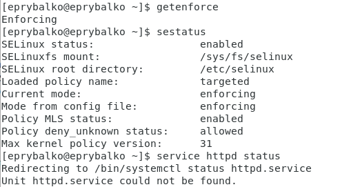{ #fig:001 width=70% } 

  2. Обратитесь с помощью браузера к веб-серверу, запущенному на вашем компьютере, и убедитесь, что последний работает (см. рис. -@fig:002).

  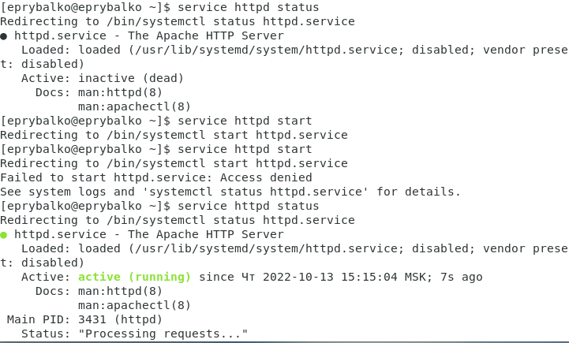{ #fig:002 width=70% } 

  3. Найдите веб-сервер Apache в списке процессов, определите его контекст безопасности и занесите эту информацию в отчёт. Например, можно использовать команду (см. рис. -@fig:003). 

  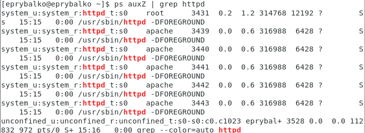{ #fig:003 width=70% } 

  4. Посмотрите текущее состояние переключателей SELinux для Apache с помощью команды (см. рис. -@fig:004).

  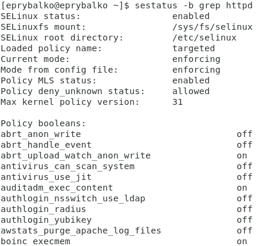{ #fig:004 width=70% }

  5. Посмотрите статистику по политике с помощью команды seinfo, также определите множество пользователей, ролей, типов. (см. рис. -@fig:005). 

  6. Определите тип файлов и поддиректорий, находящихся в директории /var/www (см. рис. -@fig:004 и рис. -@fig:005).

  7. Определите тип файлов, находящихся в директории /var/www/html (см. рис. -@fig:005).

  8. Определите круг пользователей, которым разрешено создание файлов в директории /var/www/html. (см. рис. -@fig:005).

  9. Создайте от имени суперпользователя (так как в дистрибутиве после установки только ему разрешена запись в директорию) html-файл (см. рис. -@fig:006). 

  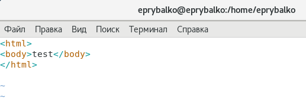{ #fig:006 width=70% }

  10. Проверьте контекст созданного вами файла (см. рис. -@fig:005).
  
  11. Обратитесь к файлу через веб-сервер, введя в браузере адрес "http://127.0.0.1/test.html" (см. рис. -@fig:007).

  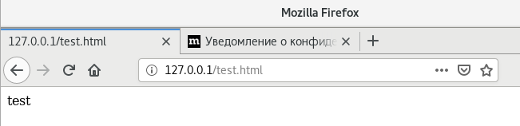{ #fig:007 width=70% }

  12. Изучите справку man httpd_selinux.

  13. Измените контекст файла /var/www/html/test.html с httpd_sys_content_t на любой другой, к которому процесс httpd не должен иметь доступа, например, на samba_share_t (см. рис. -@fig:005).

  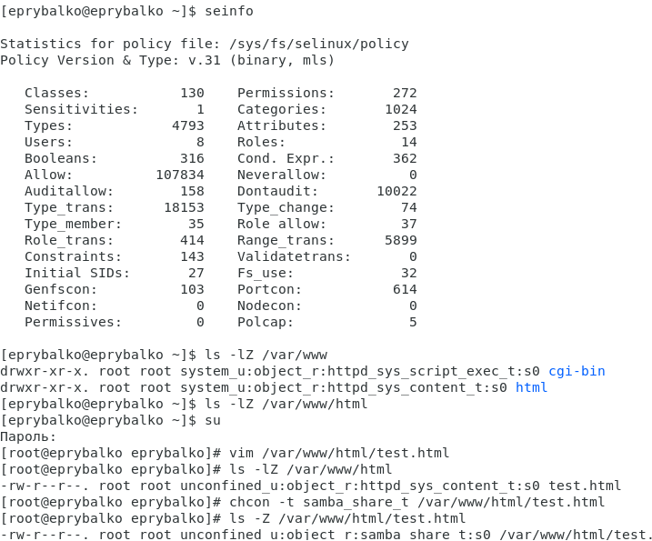{ #fig:005 width=70% } 

  14. Попробуйте ещё раз получить доступ к файлу через веб-сервер, введя в браузере адрес http://127.0.0.1/test.html (см. рис. -@fig:008).

  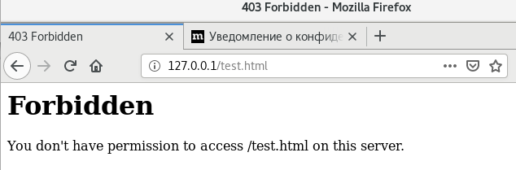{ #fig:008 width=70% }

  15. Проанализируйте ситуацию. Просмотрите log-файлы веб-сервера Apache. Также просмотрите системный лог-файл (см. рис. -@fig:009, -@fig:010).

  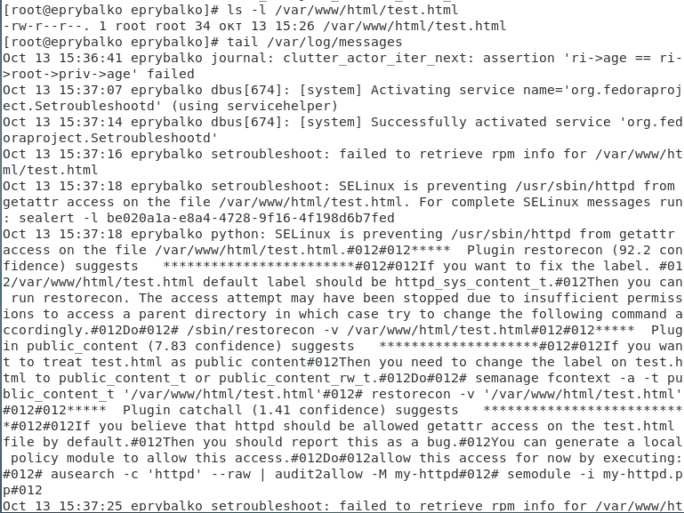{ #fig:009 width=70% }

  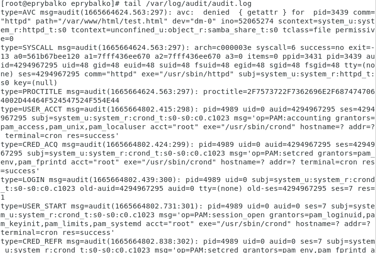{ #fig:010 width=70% }

  16. Попробуйте запустить веб-сервер Apache на прослушивание ТСР-порта 81 (см. рис. -@fig:011 и -@fig:012).

  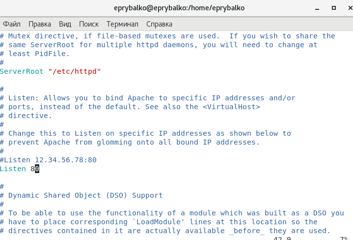{ #fig:011 width=70% }

  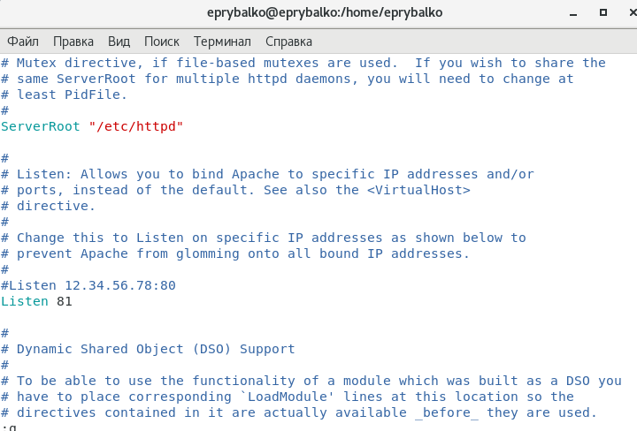{ #fig:012 width=70% }

  17. Выполните перезапуск веб-сервера Apache. (см. рис. -@fig:013 и -@fig:014).

  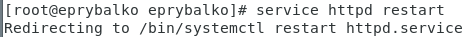{ #fig:013 width=70% }

  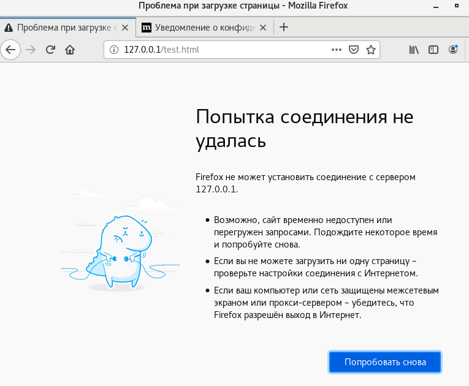{ #fig:014 width=70% }

  18. Проанализируйте лог-файлы (см. рис. -@fig:015, -@fig:016 и -@fig:017).

  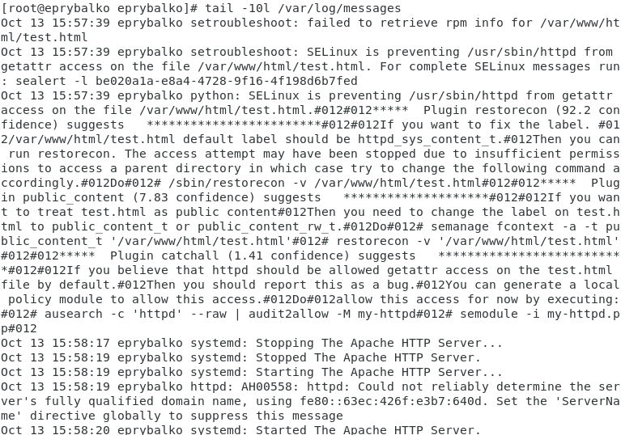{ #fig:015 width=70% }

  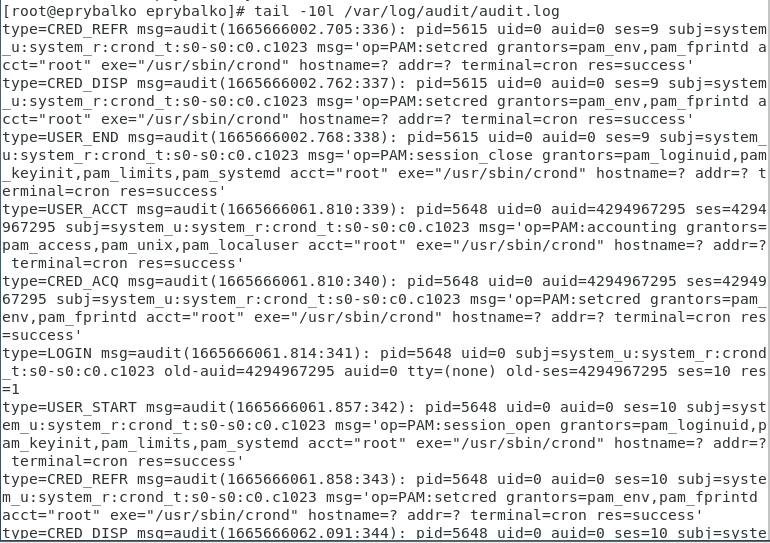{ #fig:016 width=70% }

  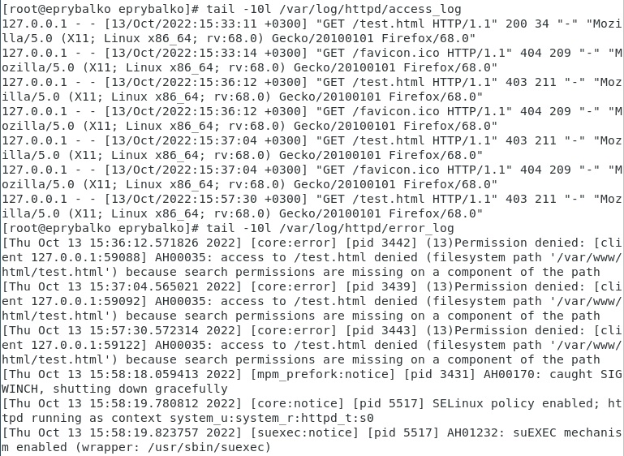{ #fig:017 width=70% }
  
  19. Выполните команду semanage port -a -t http_port_t -р tcp 81. После этого проверьте список портов командой (см. рис. -@fig:018).

  20. Попробуйте запустить веб-сервер Apache ещё раз (см. рис. -@fig:018).

  21. Верните контекст httpd_sys_cоntent__t к файлу /var/www/html/ test.html. После этого попробуйте получить доступ к файлу После этого попробуйте получить доступ к файлу через веб-сервер, введя в браузере адрес http://127.0.0.1:81/test.html (см. рис. -@fig:018 и -@fig:019).

  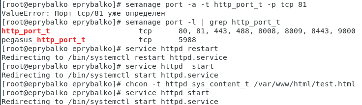{ #fig:017 width=70% }

  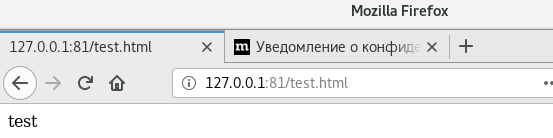{ #fig:019 width=70% }

  22. Исправьте обратно конфигурационный файл apache, вернув Listen 80 (см. рис. -@fig:020).

  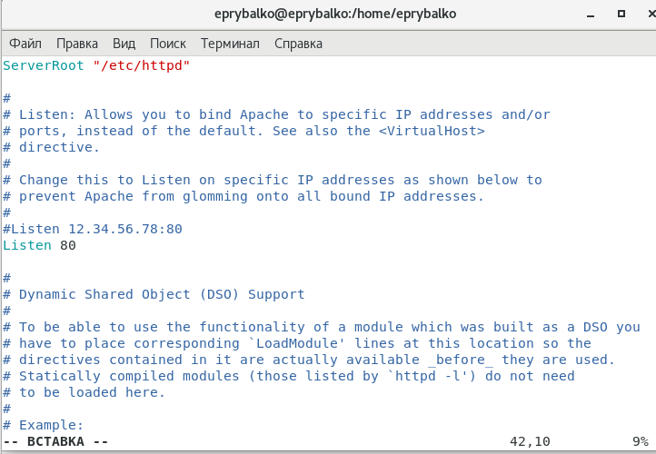{ #fig:020 width=70% }

  23. Удалите привязку http_port_t к 81 порту (см. рис. -@fig:021).

  24. Удалите файл /var/www/html/test.html (см. рис. -@fig:021).

  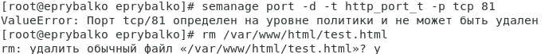{ #fig:021 width=70% }

# Вывод

  Развили навыки администрирования ОС Linux. Получили первое практическое знакомство с технологией SELinux. Проверили работу SELinx на практике совместно с веб-сервером Apache.

# Список литературы {.unnumbered}

1. [Лабораторная работа №6](https://docs.yandex.ru/docs/view?tm=1665700821&tld=ru&lang=ru&name=006-lab_selinux.pdf&text=6.1.%20Цели%20работы%20Развить%20навыки%20администрирования%20ОС%20Linux.%20Получить%20первое%20практическое%20знакомство%20с%20технологией%20SELinux1%20.%20Проверить%20работу%20SELinx%20на%20практике%20совместно%20с%20веб-сервером%20Apache.%206.2.%20Организация%20и%20описание%20лабораторного%20стенда%20Для%20проведения%20указанной%20лабораторной%20работы%20на%20одно%20рабочее%20место&url=https%3A%2F%2Fstud-sci.rudn.ru%2Fpluginfile.php%2F8544%2Fmod_resource%2Fcontent%2F2%2F006-lab_selinux.pdf&lr=213&mime=pdf&l10n=ru&sign=e25e3a152396f84a129b716f3d88de1e&keyno=0&serpParams=tm%3D1665700821%26tld%3Dru%26lang%3Dru%26name%3D006-lab_selinux.pdf%26text%3D6.1.%2B%25D0%25A6%25D0%25B5%25D0%25BB%25D0%25B8%2B%25D1%2580%25D0%25B0%25D0%25B1%25D0%25BE%25D1%2582%25D1%258B%2B%25D0%25A0%25D0%25B0%25D0%25B7%25D0%25B2%25D0%25B8%25D1%2582%25D1%258C%2B%25D0%25BD%25D0%25B0%25D0%25B2%25D1%258B%25D0%25BA%25D0%25B8%2B%25D0%25B0%25D0%25B4%25D0%25BC%25D0%25B8%25D0%25BD%25D0%25B8%25D1%2581%25D1%2582%25D1%2580%25D0%25B8%25D1%2580%25D0%25BE%25D0%25B2%25D0%25B0%25D0%25BD%25D0%25B8%25D1%258F%2B%25D0%259E%25D0%25A1%2BLinux.%2B%25D0%259F%25D0%25BE%25D0%25BB%25D1%2583%25D1%2587%25D0%25B8%25D1%2582%25D1%258C%2B%25D0%25BF%25D0%25B5%25D1%2580%25D0%25B2%25D0%25BE%25D0%25B5%2B%25D0%25BF%25D1%2580%25D0%25B0%25D0%25BA%25D1%2582%25D0%25B8%25D1%2587%25D0%25B5%25D1%2581%25D0%25BA%25D0%25BE%25D0%25B5%2B%25D0%25B7%25D0%25BD%25D0%25B0%25D0%25BA%25D0%25BE%25D0%25BC%25D1%2581%25D1%2582%25D0%25B2%25D0%25BE%2B%25D1%2581%2B%25D1%2582%25D0%25B5%25D1%2585%25D0%25BD%25D0%25BE%25D0%25BB%25D0%25BE%25D0%25B3%25D0%25B8%25D0%25B5%25D0%25B9%2BSELinux1%2B.%2B%25D0%259F%25D1%2580%25D0%25BE%25D0%25B2%25D0%25B5%25D1%2580%25D0%25B8%25D1%2582%25D1%258C%2B%25D1%2580%25D0%25B0%25D0%25B1%25D0%25BE%25D1%2582%25D1%2583%2BSELinx%2B%25D0%25BD%25D0%25B0%2B%25D0%25BF%25D1%2580%25D0%25B0%25D0%25BA%25D1%2582%25D0%25B8%25D0%25BA%25D0%25B5%2B%25D1%2581%25D0%25BE%25D0%25B2%25D0%25BC%25D0%25B5%25D1%2581%25D1%2582%25D0%25BD%25D0%25BE%2B%25D1%2581%2B%25D0%25B2%25D0%25B5%25D0%25B1-%25D1%2581%25D0%25B5%25D1%2580%25D0%25B2%25D0%25B5%25D1%2580%25D0%25BE%25D0%25BC%2BApache.%2B6.2.%2B%25D0%259E%25D1%2580%25D0%25B3%25D0%25B0%25D0%25BD%25D0%25B8%25D0%25B7%25D0%25B0%25D1%2586%25D0%25B8%25D1%258F%2B%25D0%25B8%2B%25D0%25BE%25D0%25BF%25D0%25B8%25D1%2581%25D0%25B0%25D0%25BD%25D0%25B8%25D0%25B5%2B%25D0%25BB%25D0%25B0%25D0%25B1%25D0%25BE%25D1%2580%25D0%25B0%25D1%2582%25D0%25BE%25D1%2580%25D0%25BD%25D0%25BE%25D0%25B3%25D0%25BE%2B%25D1%2581%25D1%2582%25D0%25B5%25D0%25BD%25D0%25B4%25D0%25B0%2B%25D0%2594%25D0%25BB%25D1%258F%2B%25D0%25BF%25D1%2580%25D0%25BE%25D0%25B2%25D0%25B5%25D0%25B4%25D0%25B5%25D0%25BD%25D0%25B8%25D1%258F%2B%25D1%2583%25D0%25BA%25D0%25B0%25D0%25B7%25D0%25B0%25D0%25BD%25D0%25BD%25D0%25BE%25D0%25B9%2B%25D0%25BB%25D0%25B0%25D0%25B1%25D0%25BE%25D1%2580%25D0%25B0%25D1%2582%25D0%25BE%25D1%2580%25D0%25BD%25D0%25BE%25D0%25B9%2B%25D1%2580%25D0%25B0%25D0%25B1%25D0%25BE%25D1%2582%25D1%258B%2B%25D0%25BD%25D0%25B0%2B%25D0%25BE%25D0%25B4%25D0%25BD%25D0%25BE%2B%25D1%2580%25D0%25B0%25D0%25B1%25D0%25BE%25D1%2587%25D0%25B5%25D0%25B5%2B%25D0%25BC%25D0%25B5%25D1%2581%25D1%2582%25D0%25BE%26url%3Dhttps%253A%2F%2Fstud-sci.rudn.ru%2Fpluginfile.php%2F8544%2Fmod_resource%2Fcontent%2F2%2F006-lab_selinux.pdf%26lr%3D213%26mime%3Dpdf%26l10n%3Dru%26sign%3De25e3a152396f84a129b716f3d88de1e%26keyno%3D0)
2. [Мандатное (принудительное) разграничение доступа Linux](https://debianinstall.ru/mandatnoe-prinuditelnoe-razgranichenie-dostupa-linux/)
3. [Руководство по формуле Cmd Markdown](https://russianblogs.com/article/26051452570/)
4. [Руководство по оформлению Markdown файлов](https://gist.github.com/Jekins/2bf2d0638163f1294637)