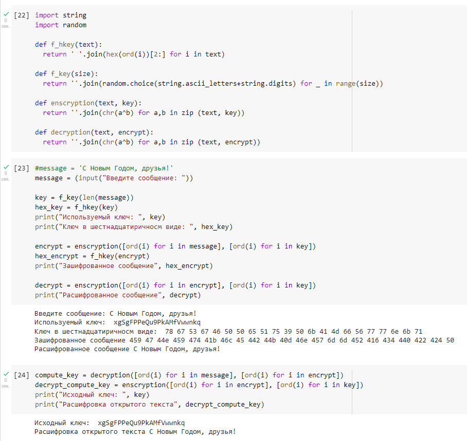

---
# Front matter
lang: ru-RU  
title: "Лабораторная работа №7. Элементы криптографии. Однократное гаммирование"  
subtitle: "дисциплина: Информационная безопасность"  
author: "Рыбалко Элина Павловна"  
teacher: "Дмитрий Сергеевич Кулябов"

# Generic otions
lang: ru-RU
toc-title: "Содержание"

# Bibliography
bibliography: bib/cite.bib
csl: pandoc/csl/gost-r-7-0-5-2008-numeric.csl

# Pdf output format
toc: true # Table of contents
toc_depth: 2
lof: true # List of figures
lot: true # List of tables
fontsize: 12pt
linestretch: 1.5
papersize: a4
documentclass: scrreprt
## I18n
polyglossia-lang:
  name: russian
  options:
  - spelling=modern
  - babelshorthands=true
polyglossia-otherlangs:
  name: english
### Fonts
mainfont: PT Serif
romanfont: PT Serif
sansfont: PT Sans
monofont: PT Mono
mainfontoptions: Ligatures=TeX
romanfontoptions: Ligatures=TeX
sansfontoptions: Ligatures=TeX,Scale=MatchLowercase
monofontoptions: Scale=MatchLowercase,Scale=0.9
## Biblatex
biblatex: true
biblio-style: "gost-numeric"
biblatexoptions:
  - parentracker=true
  - backend=biber
  - hyperref=auto
  - language=auto
  - autolang=other*
  - citestyle=gost-numeric
## Misc options
indent: true
header-includes:
  - \linepenalty=10 # the penalty added to the badness of each line within a paragraph (no associated penalty node) Increasing the value makes tex try to have fewer lines in the paragraph.
  - \interlinepenalty=0 # value of the penalty (node) added after each line of a paragraph.
  - \hyphenpenalty=50 # the penalty for line breaking at an automatically inserted hyphen
  - \exhyphenpenalty=50 # the penalty for line breaking at an explicit hyphen
  - \binoppenalty=700 # the penalty for breaking a line at a binary operator
  - \relpenalty=500 # the penalty for breaking a line at a relation
  - \clubpenalty=150 # extra penalty for breaking after first line of a paragraph
  - \widowpenalty=150 # extra penalty for breaking before last line of a paragraph
  - \displaywidowpenalty=50 # extra penalty for breaking before last line before a display math
  - \brokenpenalty=100 # extra penalty for page breaking after a hyphenated line
  - \predisplaypenalty=10000 # penalty for breaking before a display
  - \postdisplaypenalty=0 # penalty for breaking after a display
  - \floatingpenalty = 20000 # penalty for splitting an insertion (can only be split footnote in standard LaTeX)
  - \raggedbottom # or \flushbottom
  - \usepackage{float} # keep figures where there are in the text
  - \floatplacement{figure}{H} # keep figures where there are in the text
---

# Цель работы

  Освоить на практике применение режима однократного гаммирования.

# Объект/Предмет исследования

  Режим однократного гаммирования.

# Теоретическое введение

  Гаммирование представляет собой наложение (снятие) на открытые (зашифрованные) данные последовательности элементов других данных, полученной с помощью некоторого криптографического алгоритма, для получения зашифрованных (открытых) данных. Иными словами, наложение гаммы — это сложение её элементов с элементами открытого (закрытого) текста по некоторому фиксированному модулю, значение которого представляет собой известную часть алгоритма шифрования.
  
  В соответствии с теорией криптоанализа, если в методе шифрования используется однократная вероятностная гамма (однократное гаммирование) той же длины, что и подлежащий сокрытию текст, то текст нельзя раскрыть. Даже при раскрытии части последовательности гаммы нельзя получить информацию о всём скрываемом тексте.  [1] (#список-литературы).

# Выполнение лабораторной работы

  Нужно подобрать ключ, чтобы получить сообщение «С Новым Годом, друзья!». Требуется разработать приложение, позволяющее шифровать и дешифровать данные в режиме однократного гаммирования. Приложение должно: 

  1. Определить вид шифротекста при известном ключе и известном открытом тексте (см. рис. -@fig:001). 

  2. Определить ключ, с помощью которого шифротекст может быть преобразован в некоторый фрагмент текста, представляющий собой один из
возможных вариантов прочтения открытого текста (см. рис. -@fig:001).
  
  

# Вывод

  Освоили на практике применение режима однократного гаммирования.

# Контрольные вопросы

  1. Поясните смысл однократного гаммирования.
  
  Гаммирование представляет собой наложение (снятие) на открытые (зашифрованные) данные последовательности элементов других данных, полученной с помощью некоторого криптографического алгоритма, для получения зашифрованных (открытых) данных.

  2. Перечислите недостатки однократного гаммирования.

  Объём ключевого материала совпадает с объемом передаваемых сообщений. Необходимо иметь эффективные процедуры для выработки случайных равновероятных двоичных последовательностей и специальную службу для развоза огромного количества ключей. 
  
  3. Перечислите преимущества однократного гаммирования.

  Простота реализации, теоретически гарантированная стойкость.
  
  4. Почему длина открытого текста должна совпадать с длиной ключа?
  
  Используется однократная вероятностная гамма (однократное гаммирование) той же длины, что и подлежащий сокрытию текст, то текст нельзя раскрыть. Даже при раскрытии части последовательности гаммы нельзя получить информацию о всём скрываемом тексте.

  5. Какая операция используется в режиме однократного гаммирования, назовите её особенности?
  
  Сложение происходит по модулю мощности алфавита. Если зашифровывается текст, представленный в двоичном виде, то операция шифрования представляет собой исключающее или (XOR), примененное к ключу и открытому тексту.

  6. Как по открытому тексту и ключу получить шифротекст?
  
  Если известны ключ и открытый текст, то задача нахождения шифротекста заключается в применении к каждому символу открытого текста сложения по модулю между символом открытого текста и символом ключа.

  7. Как по открытому тексту и шифротексту получить ключ?
  
  Если известны шифротекст и открытый текст, то задача нахождения ключа решается так, что обе части равенства необходимо сложить по модулю 2 с Pi. Открытый текст имеет символьный вид, а ключ — шестнадцатеричное представление. Ключ также можно представить в символьном виде, воспользовавшись таблицей ASCII-кодов.

  8. В чем заключаются необходимые и достаточные условия абсолютной стойкости шифра?

  – полная случайность ключа;
  – равенство длин ключа и открытого текста;
  – однократное использование ключа.

# Список литературы {.unnumbered}

1. [Лабораторная работа №7](http://yandex.ru/clck/jsredir?from=yandex.ru%3Bsearch%2F%3Bweb%3B%3B&text=&etext=2202.PILXWxy3Gnh05hoaqFAO9KwB3Oo2SRkYnGVzNF0Sdg7aIcqTP_P4HV49itX1FtRbbwGo9U1BCdBRrW33jSFC4yMtGh_7-EIcoUMPyVcGl4SXJGttLIAxH_tXms2ltjYuIRhqrKsYtSJmyVPfBBG5AH6xseFzWLpQACt3jz5WZnYmLn2-bDEQXFiXydLGHv80TyY3aya_xJJM5DzbUhfMlWSIt19tEGtyHj7hdxX4TCVgGMz1pnlqpawfDpxHRIU2_HFDE4mWeRqB7WuYgoNLZAm4_ISrpzUI08Q5TwDuWu5Zrmf2c-9wyLyPHfmZhMMXmmrr1femJxen-knFwhSYsFwu8uPQOZxDag0oJlrVhNwvD-LdGztoJTkf5hbBMon__ceAY6DaODYp-Tt6la4ZF57bPjJIXB3ZVKjYMyr4_AAJTfKiI37_gk2bnrA_2Sm952_ULgIxUvnabOGN0P2CGheKragNA5hjb8zu8YepJnhpn5m0n22e3veSiknWyjOIc9SJDSTyrzIUDdE3XeahbgcBLTlxcMcnybWz9j-3cRiEzGT5IlYsxO73nIjYBNJpknwlLCXdYkjRxH41NH5-rcVMoOljjZIkh7mUsIbKm50PQpqCrzM5kIDebkNedPgGRWKNqVB6-Cvm4ypcj7y4MaarTBsvmnAaNdoOsJYllO2Nx-rasATkYL6ITMtxM8tC6TJmZ8COZw_q76w3X9ydgjeLS24nTxSQEpowRsozhAkRCZuzc50SJ33uUyp_R1-W-LId62w9o1aewD6kWF5uUqNiIbfp8YUM07--ly0BTv9NS-NuddcOgUbWn4lsAZIAW5TAclrM2xcCvchtGYzPXnEh7oBT1ZlRC9Bt_MFGOnPFmHfMKifx-U3hR8b0RSR2XnQ39euW71gwI89xYZ7aDtehCsRZg5bK_EYOPUJnc8tuQD4vdk6Ev1JFzG0eaalpnv4mArbql9q0DXNDlwqfYW1lbmdnZGNpZ3Fmc3F1d3E.b99318358f85aa6be6faeea2788bb953d0037a3a&uuid=&state=jLT9ScZ_wbo,&&cst=AiuY0DBWFJ5Hyx_fyvalFH-Vfi-6Zf9mipvhWMpAmX2TfxmZM764q4xYY0uH7V0B6iygewRZ8y5hJ4znoI7ra9PyNV6ncfqP6l12dsk1hfuQqK3ceNKXsHf2psZpvxsa8kPExpvD_68Mxvkd3DBmiJIAK-oppxkmCT2iM4bXJ8ZVVShshgQIE8XGCOpRALcOsXHjft-baVYKgja6DLZET-p8oK1dO5IBxvDBhMD-UlQvb_vHG_gsEY9KiAsn_TqfhbsoztFdA26BTp3GgyU8l2a9hldONAZTVwdPdOgqBgNrZ9_7z8-W0k7NKWFpY1CGSQEmKJWg2ncEQwzFmkaAXW6r6NZnwltmf4BK8GOOOMtgSNw2mFzHcl7g6DBIjeUQs7gYRNucE6KQSSZauuRhvTQbx0C19LjSPaLQrYnStCbSD4jHlf2tdTxn168vN7KlleqMvuOqhDw1ZW5pDh2l18UfNJjVHxnoGIsT0UvdEB4U060hU46j8rf8LD0PtP5nwNvQ4_kmhbkJ-c231FFNt1vCgaaWlIuv4oK30rmkWCCJrDVa3G5OMNOnypgO_NnQVtlo5a1kGkrG5NJyVwwec2Ypt7nJSI5hhLP92sgGn9mFFdaSIozgVVw6wMH2c0JJbSfqGniVGZEpnS5EpwoxdVszdERAFi9kxKzD7jxpQgKPgvxucYFu_TuOH_SxmAd9txpEZvKjXXP8mKniR9DlmZYKsuTTk7YYoak8FIg7oozRG1pwXXEHkSAqVlHRglmIm4lj15TcKMrlz32KY24h-SevKYunpbsYbecmNPx7QK8Cjc1AhCtFINL-vtX7Yw7GWrW2tlZLuRE06Qrs61_Z2uCQYPq9a0HZVFhCBdpAhVNh5oGRjcasJBQivT_ROL6-2dGWH6kH0NUeZTKGCSrKuwGuffGz2pwye2jWUV2lAjaDFilz0TD-T-cinklLMV5ALxtLsbGiaNtA_uwhnSIF9i3sUmbnFvFw9rfh3OiGH8jCXK2I-NhkVaGlACj_CpFPCKmhBf5evsjp4McmuLANBdQkTyc7NuTT0yHgyVu_GvtSHcd6Akxg1GPXkyGpvkkM8KUKKfptutagWgSZYUg95JG28ISWCF3JVQ1fRve1pYnM68WspkHudkGq5j_14ilasdYHIa77WlYQTalxoedcWbXzkBFYc25g8znduVgEAavoriWincdK1ZYLJXOwup_rPat3YD3k7inx6ZOn_xqRlY2vKkWVSuA_G2MNP_kIunSZM-6MozwS91tMMsmI1f94Lk4k-KK2YRKGxyoDj_poXjtr7_Jy92bypNs2K7dM1iqNpwEUvd9E0j7FEQ_geEvilQ6fXLZl-A7TGpZLC_dTSsNawnMNH3iH3JRn6jvWFPOqjj42NxsgV57pFD11Wc875b2LNFAvCNSHQnpG5tIuohdJLQzoJrjBhOMRn01DxYEKY3L8Wmnaz38XpYFdngGKS1N9qFeVjqRMGe3n3ERlf-7VW1q4kEekOz0pFhy00siz9ENjcdzL3yoI8th6FKXNO99gxZ4vwnDprwJxPYTSPyRe070fhvn5n6YvHzGt-tE,&data=UlNrNmk5WktYejY4cHFySjRXSWhXTHN5Nk52YmswTXRfeWgzM2R6VjdOdV9WbTVvdW1wcW0tNmFubDhkOXF2QXBDUUpFNHl2VHRtYWtheFd1cW9Ic0JZQ2QtaDRIWlY3cGZ6SVo3TWhFZEZBNVEzc1JEbUllcm1zczNuUTJTZWUwVmhIMndVWlBzdGZQZGlCTkR0RDAyWWZLeGVsWjBXT2s2VGdFaEpuMTJ6ZmJ4X0YycWU4Rl9na1dFQnl1WkNnZVU5Q0tlZXN3WEks&sign=cf8e9b04ff2a4001465de708a579f7ad&keyno=0&b64e=2&ref=orjY4mGPRjk5boDnW0uvlrrd71vZw9kpVBUyA8nmgRFdzDAzzyzIinqUWPw7zrXjmxtGSOOckDyh07nZoWx3WK1Vh1YITZh5nCTsgxruUIsk9DQt8bxBGoRacZek-b2_YAZ4ENFL3uFrj2otRSIK-sVOjPYnbknx1iUyX8UJna4r7AIgEwKWDPb5AmSDXVSdAvOUJvxmLXl5fIgE6uHGufm8x7KLEI8zNK2EglV7gxkwO4mJfpiUsrabx_alKPWPZTXq3P6lM4bBjDqNHbACharVy7NR-T0nsVvXY8rDvDC404zUz8PXf9MaPx2yvcghxmWG05DlXIIjtuZbnH-CCS5wtKpXHibs1rW0a2DB9o0rdk0nzA1SvPtsfRBRVc-SSnjXzSTsIbFykecSE6b8smXjziIxp95y-RgWwUwOgM63S89wKlYpHrdASPL6-liVBbB2xDjJPX4NEL5ekdODoIVlLUmODiHH1Wf80O008R8Jdv5ZuUWtkZpYhifc1k3tNt29d9eNqBYWPxU_dbChY2Utw2f3LnUlBXHhDh_Rr_lV5449zY5qDmoExEbThwYlabuIpBlxEKQvEux2zxIs7vDM0wLT0Jw3bIzp7LAbhp02iQQnNeaAqCgZWAyDGjIIfcpZpVT0NbXax25nMPBh6Vlbzgm3UDivu9fL8o-f_W8zlIJcgGEWeD2WP4mPtg5EF7Vmk1cFCZ2bN3ZAEXbsKUGBDPaQqBCRfQTUkLlBQ_gYkjxtt-_BEbxOI3uDdUnNUSfYMD5vEgbGvqkAfnUrotdFKr2G0M4NCKzS0fsBc_kZfKYmXOLvkts_3-3lNJleeWlEX9RdtRex5jdXqSAy-bzaUOryrpuwKyI-kJCBgo_sOB8CzpmgMVb3mDXNt_XznMIuZg1IoW5hbpe6MEV8ffphlJvv4T2srSn1Ch8dvefHSoFxDL9WFhUn62UrZNwaSvRdhZ_giQTp67DQ29zer-stiA3YwNsIKUVjVfgPs9ZLYlCBOwERNNc49SgQI2TE4_pdHaIjaHNX-CeT063X3SOY3GO9GLUf6sL5_Mh4mTLVUznv-97YoCEsP1u2TjGQf9-kluIo2IgJVQLCssYw3RaABPhdVFmzgXJpNf9VPzc2c4LPczm3nNE537RjMfYQ4RR59lNw9Fvy_OIodXa7nKhBVbtIzeY5IFZLZoS6O7_VrjbVcVFJ-V2aaj10db7-Xq2S-fJPNUVNIkVVSHMk-PBPe_RIenBcY7erVYWvokqlVg7KSa56AwJ7Nck84cDRZ3nZY20y-Lr8gJJfNB2xZ_sJvkFmLCHIylyKFteQux1wYPBNktjbrKxsdBneiEYr6FQe-MsI-8bFdINvn6uZMJ23JNjZ1kOJiunECvKAd31XlKBSNS7iSnwCK9zsVWAbMG7Gag0UXmLZorexHu5WQ03byXXOLAXeNZEby5J6gakRxjKY6jKylI8WKFv4jTn9d7kP--GApTTQKWJHS1KvyB_JsWWSb8x4uNv2tvjiyGE_1xgfj3k6k_8knIaciPe0PQRmeogCNN4zbS7J4Kc1wqtkW_7wB138aK1j-gesFso6bpubstYAlOqX5gxC3w9a9kuAHTn83qsf73Pi5QS6U4SmCRZ7ppEaRb4-ZPEHLl6jKHqTw13OVJf77cdjhyXDsFXlx7gK38E3Gthmgkx3DkCo8byZ8XvBgYCC62HACUVNNm1i5niIoSD4-17_VNeiZ8FfcQs_d-zhqhEG2cDo_9dM0v1hq_RVDvk_suG69w4cHiSx9tbTDjw60P10yZCCv8ZzFKoSMR4DnoWJAmysRKbuScvN9xG5mZE_vHDd6HsRJk0k5uRGd6NGm3XyTX1K-3sHVisF2eLnnUROdhbETWsh7kbc8salPYTwzrl80q73pI9A63YDDj8T0Ll6clLY2ttEp5AI-vtRwYNJWczuT6nvbsPX4cG1wzw8o-7tCMhOw0chA-r0QrUnceeADlxw2acFG-H4D2fOUS5ci5GXoHboWJr4RWaOh8NgSApzdLo1ObBra6q-lS07BDgbAOiNq4wX_uNYQUen0PZnf8d1bJ6VEEu1OAZbopxMBEbYrJrTOpy7ISGgcQa6bnr47LSJ6s4e3iYWi9AlU2q0QbQslgMbD86RplGYvJr_NS1SgvhJnYgIzJWrDBRpBgbwgjg9E2ohx0soyuca5D5_A8uJgcX1YspORDy6Iz4N7Q72eGVc-C7ACEKWknIE0Yty0mh9f3ejpltdg_vdFQkSd0LDtniBJ3uAKnSod0GMSbP45iGQAcO2VKxSFNojdeqvwpN8LUa-0pUZXlQ6gy9lc8zctnPtOhz-UWGriberJvw4ecZ723RqMBYTraF1puJwaZDhnRoSChUVnbUSHddJpJ6Os9ZhaMJkpNMLdgDdGwaYtCNLmXhYHcmMstNUP1eDKr2BXpeBctLpn1_NyXkTegtdfIpabVJTPhzoitAgEm-Idsq_iH993c_udrvRYcQZ64mIWTaNJhMKVIjt-dRLrJTgaIrjJMwgI6_s7wYOIctdKlvwAfXo9_KcKnVFOwut0NvW4aF4R4OAJ3-Qqg8KJSP_Hh-oWHIL5Ro9mhORfvU0Mn_V_4el3mI1ltqes-eY7qfEeZZUQpkAbeAXK-PCG2UjKzAQabPMqmnUsr20GsjyInDkrSRR6UPh2ktjl6HMtHJ6llbG1PLR4AUC2oEVuLvLBdoI7mDDhNGLhCsE47alElt96aARu5MSBUC9WpKgbzCHN8TH3IYaRZJSkn4m8Yb0drKv83xrqePa_O5bXOgwuPmkH6F87uSEPEX2nhIHRYsD_Y-ORN3krcOugHoXZ3SCziA06_MF9e2JdW_BdyKHx-JMktAcDBeNUvBRzy-7n5cgvrsz13u7QylxxOlpASwKAYXtk97uEZVc5tAIBFwknT6PWq2hXN_cbMByT-64qDNw&l10n=ru&cts=1666439765704%40%40events%3D%5B%7B%22event%22%3A%22click%22%2C%22id%22%3A%221_1p23w00-03%22%2C%22cts%22%3A1666439765704%2C%22fast%22%3A%7B%22organic%22%3A1%7D%2C%22service%22%3A%22web%22%2C%22event-id%22%3A%22l9jv7kjsjt%22%7D%5D&mc=4.503416638553355&hdtime=43593.7)
2. [Использование однократного гаммирования](https://bugtraq.ru/library/books/crypto/chapter7/)
3. [Руководство по формуле Cmd Markdown](https://russianblogs.com/article/26051452570/)
4. [Руководство по оформлению Markdown файлов](https://gist.github.com/Jekins/2bf2d0638163f1294637)