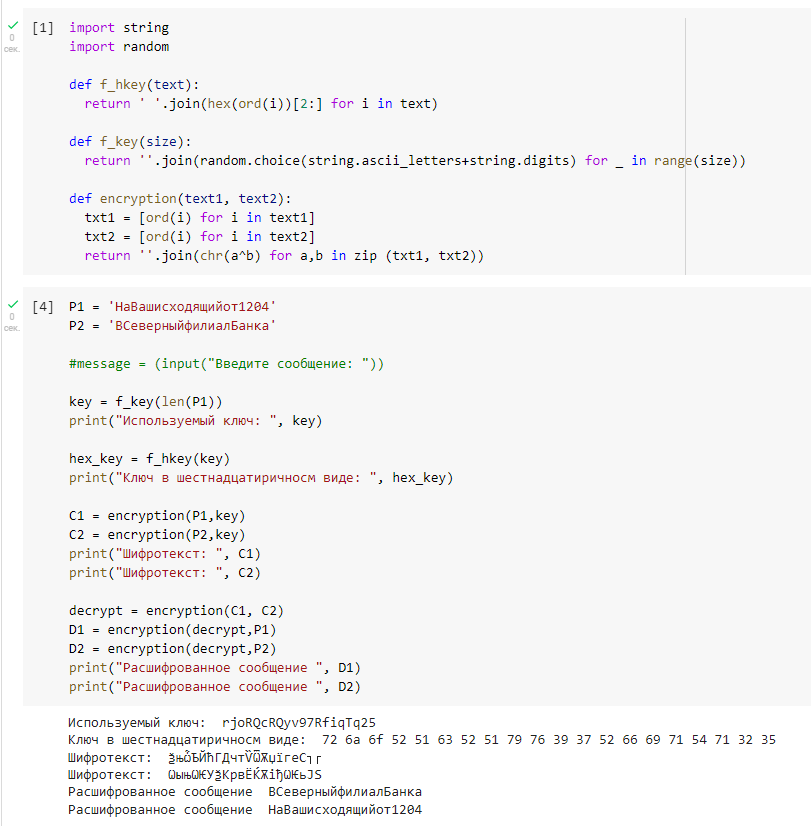

---
# Front matter
lang: ru-RU  
title: "Лабораторная работа №8. Элементы криптографии. Шифрование (кодирование) различных исходных текстов одним ключом"  
subtitle: "дисциплина: Информационная безопасность"  
author: "Рыбалко Элина Павловна"  
teacher: "Дмитрий Сергеевич Кулябов"

# Generic otions
lang: ru-RU
toc-title: "Содержание"

# Bibliography
bibliography: bib/cite.bib
csl: pandoc/csl/gost-r-7-0-5-2008-numeric.csl

# Pdf output format
toc: true # Table of contents
toc_depth: 2
lof: true # List of figures
lot: true # List of tables
fontsize: 12pt
linestretch: 1.5
papersize: a4
documentclass: scrreprt
## I18n
polyglossia-lang:
  name: russian
  options:
  - spelling=modern
  - babelshorthands=true
polyglossia-otherlangs:
  name: english
### Fonts
mainfont: PT Serif
romanfont: PT Serif
sansfont: PT Sans
monofont: PT Mono
mainfontoptions: Ligatures=TeX
romanfontoptions: Ligatures=TeX
sansfontoptions: Ligatures=TeX,Scale=MatchLowercase
monofontoptions: Scale=MatchLowercase,Scale=0.9
## Biblatex
biblatex: true
biblio-style: "gost-numeric"
biblatexoptions:
  - parentracker=true
  - backend=biber
  - hyperref=auto
  - language=auto
  - autolang=other*
  - citestyle=gost-numeric
## Misc options
indent: true
header-includes:
  - \linepenalty=10 # the penalty added to the badness of each line within a paragraph (no associated penalty node) Increasing the value makes tex try to have fewer lines in the paragraph.
  - \interlinepenalty=0 # value of the penalty (node) added after each line of a paragraph.
  - \hyphenpenalty=50 # the penalty for line breaking at an automatically inserted hyphen
  - \exhyphenpenalty=50 # the penalty for line breaking at an explicit hyphen
  - \binoppenalty=700 # the penalty for breaking a line at a binary operator
  - \relpenalty=500 # the penalty for breaking a line at a relation
  - \clubpenalty=150 # extra penalty for breaking after first line of a paragraph
  - \widowpenalty=150 # extra penalty for breaking before last line of a paragraph
  - \displaywidowpenalty=50 # extra penalty for breaking before last line before a display math
  - \brokenpenalty=100 # extra penalty for page breaking after a hyphenated line
  - \predisplaypenalty=10000 # penalty for breaking before a display
  - \postdisplaypenalty=0 # penalty for breaking after a display
  - \floatingpenalty = 20000 # penalty for splitting an insertion (can only be split footnote in standard LaTeX)
  - \raggedbottom # or \flushbottom
  - \usepackage{float} # keep figures where there are in the text
  - \floatplacement{figure}{H} # keep figures where there are in the text
---

# Цель работы

  Освоить на практике применение режима однократного гаммирования на примере кодирования различных исходных текстов одним ключом.

# Объект/Предмет исследования

  Криптография. Кодирование различных исходных текстов одним ключом.

# Теоретическое введение

  Гаммирование представляет собой наложение (снятие) на открытые (зашифрованные) данные последовательности элементов других данных, полученной с помощью некоторого криптографического алгоритма, для получения зашифрованных (открытых) данных. Иными словами, наложение гаммы — это сложение её элементов с элементами открытого (закрытого) текста по некоторому фиксированному модулю, значение которого представляет собой известную часть алгоритма шифрования.
  
  В соответствии с теорией криптоанализа, если в методе шифрования используется однократная вероятностная гамма (однократное гаммирование) той же длины, что и подлежащий сокрытию текст, то текст нельзя раскрыть. Даже при раскрытии части последовательности гаммы нельзя получить информацию о всём скрываемом тексте.  [1] (#список-литературы).

# Выполнение лабораторной работы

  Два текста кодируются одним ключом (однократное гаммирование).  

  Требуется не зная ключа и не стремясь его определить, прочитать оба текста. Необходимо разработать приложение, позволяющее шифровать и дешифровать тексты P1 и P2 в режиме однократного гаммирования. Приложение должно определить вид шифротекстов C1 и C2 обоих текстов P1 и P2 при известном ключе; 
  Необходимо определить и выразить аналитически способ, при котором злоумышленник может прочитать оба текста, не зная ключа и не стремясь его определить (см. рис. -@fig:001).   
  
  { #fig:001 }

# Вывод

  Освоили на практике применение режима однократного гаммирования на примере кодирования различных исходных текстов одним ключом.

# Контрольные вопросы

  1. Как, зная один из текстов (P1 или P2), определить другой, не зная при этом ключа?
  
Шифротексты обеих телеграмм можно получить по формулам режима однократного гаммирования/
    
  2. Что будет при повторном использовании ключа при шифровании текста?

Повторное использование может привести ко взлому шифра.
  
  3. Как реализуется режим шифрования однократного гаммирования одним ключом двух открытых текстов?

Открытый текст можно найти, зная шифротекст двух телеграмм, зашифрованных одним ключом. Для это оба равенства  складываются по модулю 2.
  
  4. Перечислите недостатки шифрования одним ключом двух открытых текстов.

Злоумышленник получает возможность определить те символы сообщения P2, которые находятся на позициях известного шаблона сообщения P1. В соответствии с логикой сообщения P2, злоумышленник имеет реальный шанс узнать ещё некоторое количество символов сообщения P2.
Несмотря на все преимущества криптографии с открытым ключом и вероятностного шифрования, ни одна из их реализаций, предложенных до сих пор, не может конкурировать в скорости с системами с секретным ключом
  
  5. Перечислите преимущества шифрования одним ключом двух открытых текстов.

При использовании же криптосистем с открытым ключом стороны не обязаны встречаться, знать друг друга и иметь суперсекретные каналы связи. Длина ключа зашифрования не имеет значения.

# Список литературы {.unnumbered}

1. [Лабораторная работа №8](http://yandex.ru/clck/jsredir?from=yandex.ru%3Bsearch%2F%3Bweb%3B%3B&text=&etext=2202.6Ks5tK5ynqN93OCGrUfZSawGiRcJo7IZiNZ6bAFJFDX02SaSdotwTkGAW9iDCDuhjGkOPjKUYrroANLiCrX64sYLOj4a4TvilbjdKhGpnDO5PLl4v0AK_P4ap5SF-SYa2uume9VtXSkD_0S2p-QSsCnvUPnKqC-rswqnFYw73SUXMfr060mhvgU8_239befsF6AGzqnWl_kfJ4JJHidijIxle6-zbXHhomroq-j6OovgnDC_eAbytxSdFywKKpwEGJbTOACjdhYtOe0V9b18fohx7HuM0dYAHb_SJyhXOZxKMcW5lT2phn4zZUNm5ns0fYRgjmoqHxdH6waA94R6Qr1ai62ebuPeMXiThsJy80gDSCpd8TzZHm1NMxud9zIhiH3nfNklntoiDvQypIL-nJ2SLiFDojWMX-DjAX7EVOSbgMIJiRTYmEM229IoWJH4xiGXf2EyahmP0k2ECIEEvwSrxsEYPOdMcWEd9hx9qpbs48i8XkB9tr2HLFc-0bkLyFUpP-NybGa10RETHmrZx8Fy3mu-OuZiYTK0IDaH2tZ6wUQ4hh_aBfXRDs3c2_TFEdumtgimx3lrMwn6ypSSuU844tOpLH3r4fihYTtMZlycyk_Za3PIwOFpQ_dGR83uLb0rO6JRmjswXeYk9gZRHnE5sjrxuTA80ibgakeIbHN74zqnRMg16EGkXiex05TahBBv9sch3_xUgIx_xQu3c888AA9n030hcOQvr5Q5fGcz8R0P2ziv3l90kWLjsGA45Ui-IBO_MptQM_U-Mw_wZETZ9t7I4ZmAX6m9e-d201GfvQ6fit44iUzbfHTggAjCxTqSSq0uR7-moSpwmE_JvzyrDZOd8sezz-oetpXKtokvR_F1TJIhseXIpW7PID8MjfZCAYn3PRkfdILvCxVNuDoegaX7PbSq9Dn72MZj_lwwFy7pCcT45m29qdyYcdEAM7j8wkcHvS_oXIPpGjpN62dmZW56Y2h3c3ltYXRjdG4.4db2440fb0254480f9d303ca3d21ec96716bec46&uuid=&state=jLT9ScZ_wbo,&&cst=AiuY0DBWFJ5Hyx_fyvalFH-Vfi-6Zf9mipvhWMpAmX2TfxmZM764q4xYY0uH7V0B6iygewRZ8y5hJ4znoI7ra9PyNV6ncfqP6l12dsk1hfuQqK3ceNKXsHf2psZpvxsa8kPExpvD_68Mxvkd3DBmiJIAK-oppxkmCT2iM4bXJ8ZVVShshgQIE8XGCOpRALcOsXHjft-baVYKgja6DLZET-p8oK1dO5IBxvDBhMD-UlQvb_vHG_gsEY9KiAsn_TqfhbsoztFdA26BTp3GgyU8l2a9hldONAZTVwdPdOgqBgNrZ9_7z8-W0k7NKWFpY1CGSQEmKJWg2ncEQwzFmkaAXW6r6NZnwltmf4BK8GOOOMtgSNw2mFzHcl7g6DBIjeUQs7gYRNucE6KQSSZauuRhvTQbx0C19LjSPaLQrYnStCbSD4jHlf2tdTxn168vN7KlleqMvuOqhDw1ZW5pDh2l18UfNJjVHxnoGIsT0UvdEB4U060hU46j8rf8LD0PtP5nwNvQ4_kmhbkJ-c231FFNt1vCgaaWlIuv4oK30rmkWCCJrDVa3G5OMNOnypgO_NnQVtlo5a1kGkrG5NJyVwwec2Ypt7nJSI5hhLP92sgGn9mFFdaSIozgVVw6wMH2c0JJbSfqGniVGZEpnS5EpwoxdVszdERAFi9kxKzD7jxpQgKPgvxucYFu_TuOH_SxmAd9txpEZvKjXXP8mKniR9DlmZYKsuTTk7YYoak8FIg7ooxozXJi2Ui0OAY95h9tcndfk5c6Ow1caKAcAjrw9tBZdkBnSNVmGFtT4XOkUXy_blSUbFRd68rGNpG7mhA2OLrKzQSaXsjqAJs1Rl2G9sMCwXt1FUlB5BMUCaulb2akMmQg777syBcMN-HzNrBp4_d97A9-0tmF3ZEj-ITAFdFy66KShjuqAtRNTIN3wjBJdLe3PNRIS0a4TkqU0R9bIjBMtmqyWktJn2FyTN0nT11q-z2R05v0RZKYELbexriKtZf4LXEOKBmMACzrOH3l0s8Un9VdK3ZnPlvc0jjlObDiCanOwhxLn4aNwJrBjGGSCl2GpcN40dbQYzyyn7g2G4Jvp2Jne7nknB0RZIbk8IgB7OLE9qE2Vyb1p-SvYf0d4YkgnwyjH8_dRBESr_HHiqXrYP9muBKC1svHsmlDR9u-_L5jMMY85D56EqHs938QcNe6e88qMeOLHLoWEWVhyMIPRoZgI4SPS_DkcgCegAz-oKR9CtfjbxBmqI6R3syRrb3aKFQkY9FBl0vGHL62q6pktatzhcqMBImgW-J-X7JBP5R86gRVpDKxsp3pWsE2fQGILfRJlG4pgfNdBd6ClVWPzXadjkA82smDuFif8mdyu-iOYHoHTa7w9GUi1h_UKPOygLlrn7eefYMIZ_QxXOb2gIW_VoYheZFl3tzcaDzzGoxSkHcicFvAW89XDaq6AGhRcw_H0AfqIbml2XwprwqJ0uS1GY-YpNg9fqGvS3eYsEPbc1hsNsR_7oe_dp8BECB5fIht85qND6xlvegpHfHjgsNn_TaMGZW4QD5MWXbFEugzr2Fk1a7nUx9VRfQbGwc,&data=UlNrNmk5WktYejY4cHFySjRXSWhXTHN5Nk52YmswTXRfeWgzM2R6VjdOdV9WbTVvdW1wcW0tNmFubDhkOXF2QXBDUUpFNHl2VHRsdF83OG5xcG9mWFVsM2dLYjcxMEhGZkpWU3BhOWxIalhlZlhMU0JGY21kVUlrQnZ3bWtIblZRVXRDX3d0UEtQQnExajQ4RVg3Qk54Nk9CUDlxaHNTbDUzdHFUTV9aX2JTODhVZl9YaTZZQlpNZEwyZk92ekdHRGxjUk1WWm5vY0Us&sign=d0d5fc3dc885d6f79871713f9c2d9a45&keyno=0&b64e=2&ref=orjY4mGPRjk5boDnW0uvlrrd71vZw9kpVBUyA8nmgRFdzDAzzyzIinqUWPw7zrXjmxtGSOOckDyh07nZoWx3WK1Vh1YITZh5nCTsgxruUIsk9DQt8bxBGoRacZek-b2_YAZ4ENFL3uFrj2otRSIK-sVOjPYnbknx1iUyX8UJna4r7AIgEwKWDPb5AmSDXVSdAvOUJvxmLXkATQpi-lRCy6oYtwKalPf-sQgaFdgbscdf90F0tN1ecVCO1mewkrQo_CE-h7N7co8jeMlns2Z-chJA338yRpT5GUWcqgxvhqegGd2YaiNZ7fKZZq99MIb55Ol6D5NK5M5GmieHB1UBzvhYBJrFKduvDUAl6DcCU-XMpJwTiG24xNiX3ChjhGq6MCst9z_wjdFhOSlemnkpzM8Z-9A4OhQ5DrleBzqZg8WPSMYunV1p6rlnerxZa9vNGgLGl8odKZdp1hIPweqwwvx75F8pOQG4cNU8XnlB7vj5q_XxvemRnqvK8zKGRJY6MnAvYwsBUMrcTCZdI0EjxKrBrt9lKiUMMvpcOuMvBurhZ3runf_WbmR-P1Cu-OQL4paDNd0xewU2xTvueGft_tieWGgZ34hOQhof0QbdlBksdkWRAl0g5qr_3tfH58bRH2uLxJNunUxWf-8FgxrF0EW-lHWkCFsLYDkxE7-J5cd3hIO9sT1Dss5Kb7Za57pfaqfOtbrc9eqqdxEwudsEph3cP-PwAuP_kChJVRYEbZOJ4ym4GKU4euON_wMv4M1UWx-skOfGBon-rxoYFEZminQQJnU3Z7Nmf_ne8JuYCthXHHe0pn4_EdcpT8nmSHpFo1TZ8pgyxzTdW0pZRtFP-tC345ZXkT87tYFKM4d2ZmP8C9iMUaXDyk7tVsxcYQU6WyaqsbYBgoqqm5ODgNdoa-OXpELkNL3D8-uimVUbRy2c7IPuHq8cb8u-IiC7PiNVWavwZX1h9Js0hPGWfiLz-sBrzTPV8hO_RhunUy6RahGT5Sw1yVxEWaWqf00JTP2pw_LxOyB6bL4X608MA4V-vRSFD4yn_VRknJ2UE9g4HVaGmKQH2FDSHAZsq6iMdxphRHbRkluXJ_z7o-hrpOnMDAOinkU-6Y5DAVfuVtNBLXj5AlCFlEM7auc9Hi1Q4wQH0LgQHKbXmCeHIrgWBE0TMbvl_I22TJo-jSbtpk_0ws7P_3U9Oz3_uEwKWjH5NxODK6cL7P32sbpZ-9lvccBXu8GFPo-oJiC7t3iCwXoY3UbdBoTQ-J90V6xkmVp-5y4f39KEZBHEb_TTEl8Ed0dTY1P_CDQhEP30tKqLDtXjzBJ-j77Gvo_0-_2RlXG0qeqVHjsenrg-lBYrndbZMlQkAwlj4WRebvsPh6I6FtWCIetJBnelrL3lYdSCl5BW8fSud6iO7D0X7KsPvkyGtjpjipp-graIgHlMqQaHYM5MNQwNEFdqtWGlfXbTr-OqPv0G7g5LQG4em14gEu6yhnHrIoXM0oxONu4uuqWenuWuVkL3a3UL-biFrCdResWiWk-q2zsUjpZFsQVs6_CIxUqzDd31wBoon1KETnFFXb03ZcHb-8Qd3q_a0cnEFfy8iNzb0827GKYdvjvpgfEthTPsnCS0oWvzE3aC5o0yKyQGoW6SRsIC6EZzoxkZ-x7DSFBEaj3Ek4jcqrokCokqUiaaGgbO588bKIYBet1Hyl4rLjtZqhgeAPjWkWFrvQG1CfU974lYcn9zsVP0nL-NlJ3tZiS7yPXZGTaBKW3jgYzKcVzvhPyNtnuZeygFnH5a119crqBPmS6SOUIIpCpo8UjNnTzAcAViC9M9ooqKCWQngrFuluKYK-psZ_HQ8zvj6jX6lKTq8TksQv6xDecI9Bzvl4OpT5Vo0EVP8aHgtbC1WiFE4I9HuFlrM5T14f0O9AxIgr61Lmgfs1oc8IyJ2hk_SJ_2EiqrNYrMmz3Hhnky3G2ROvbW4Jsn8tuN-39gTvDXRR1pR1skav_rlNvgmoUu10Fd76gYjeOxMMoRV43JzJc9RWa8cu1ywSsbrBIJ8I1ReHI03yYy5EGr7BXygeNJmMf-qlxJ4BwAN75RM5vWI9eDiw3bDB4Y3aMounT7ukDz8iQ6MrAChd9JPaOQaXLOUzZKTRnQN0LAaC8d-mZ98opoj9yz0s5WZyFDXm80KxnAOtP4NUOHPH4QdT98P0pKTaaICoQOAQd4nKTMjelFoWXFhE4I_lHWQZzd8OYqo1JzKwedJrasyNUKrNKofUBG0rWCc81ESXWR1hdLZ4BjV8oGTsadedqvh8Rg9iPqPBJICWhK2ctJec4GDhZjf0TOLQeFY95T5z4TpAiM3YDRpt3RN0TZYNNnDk5PwTKqOmb0VXa1gDU8OQaEARkJQr-eSleQbAWanBR9_XgUDioXGfO_zUQ-AxWAxRxC9QzXq616J2BN67qcQ4g2xB1WwXs2fbWkzFgqeVvaaclHUiANEhHiWdTOcwJNlewuGoysAchN2YNYscKUH3CAFXqk9jVzXdFTW-2Oyr6zhlfCFkI4rKnfxjJsW90wDb5TwmDHYeWVfobFe5b1IhcNHYdWIxA2NqRlpwkI64ZGrFHSuKGkDTl5O_ArFzgM90F2q05wOGBuLcKer7mc9cJnQv8etbeWaL2AQm2Jqpl9Q99Ke08oyyMojWkmu4Mx9uRmaVW0VYExa1726evf3BMx7Fgg76SC57FQBtktIxOSFRajBDtaxg5jd8yh2TWQxB4uHT8NKB-8zi7BEuN_R3QjHi6_OPLmd85Zed8nu3UTj-gFvlr4hDNrd10tWJ6XPvJEXoHDdJyXdRvEozYu0KB0-xqGQa9pXN6Qumhd_jJzokuAKhXuPnCNl6_8OMPl4AdQZv2-qTCVAgzbgjg4s-5-CuMmKRe-DprqqgGjvil8&l10n=ru&cts=1666453455086%40%40events%3D%5B%7B%22event%22%3A%22click%22%2C%22id%22%3A%221_hpxw00-03%22%2C%22cts%22%3A1666453455086%2C%22fast%22%3A%7B%22organic%22%3A1%7D%2C%22service%22%3A%22web%22%2C%22event-id%22%3A%22l9k3czcexd%22%7D%5D&mc=3.772055208874201&hdtime=11789.7)
2. [Использование однократного гаммирования](https://bugtraq.ru/library/books/crypto/chapter7/)
3. [Руководство по формуле Cmd Markdown](https://russianblogs.com/article/26051452570/)
4. [Руководство по оформлению Markdown файлов](https://gist.github.com/Jekins/2bf2d0638163f1294637)