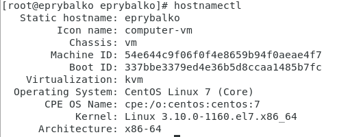
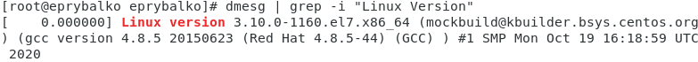
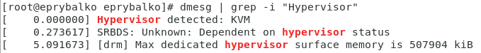

---
## Front matter
lang: ru-RU
title: "Лабораторная работа №1"
subtitle: "Установка и конфигурация операционной системы на виртуальную машину"
author: |
    Рыбалко Элина\inst{1}

institute: |
	\inst{1}RUDN University, Moscow, Russian Federation
  
date: 2022, 10 September, 2022 Moscow, Russian Federation  

## Formatting
toc: false
slide_level: 2
theme: metropolis
header-includes: 
 - \metroset{progressbar=frametitle,sectionpage=progressbar,numbering=fraction}
 - '\makeatletter'
 - '\beamer@ignorenonframefalse'
 - '\makeatother'
aspectratio: 43
section-titles: true
---

# Прагматика выполнения лабораторной работы 

 - Приобретение практических навыков установки операционной системы на виртуальную машину.

# Цель выполнения лабораторной работы

 Приобретение практических навыков установки операционной системы на виртуальную машину, настройки минимально необходимых для дальнейшей работы сервисов. 

# Задачи выполнения лабораторной работы

- Установить операционную систему Linux на виртуальную машину и провести настройку.

- Установить имя пользователя и название хоста

- Получить иформацию командой dmesg

# Результаты выполнения лабораторной работы
 
{ #fig:001 width=70% }

# Результаты выполнения лабораторной работы

{ #fig:002 width=70% } 

# Результаты выполнения лабораторной работы 

{ #fig:003} 

# Результаты выполнения лабораторной работы

{ #fig:004} 

{ #fig:008}

# Вывод

Приобрели практические навыки установки операционной системы на виртуальную машину, настройки минимально необходимых для дальнейшей работы сервисов.  