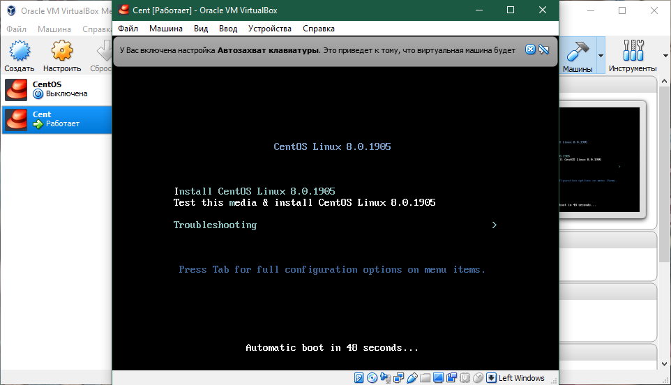
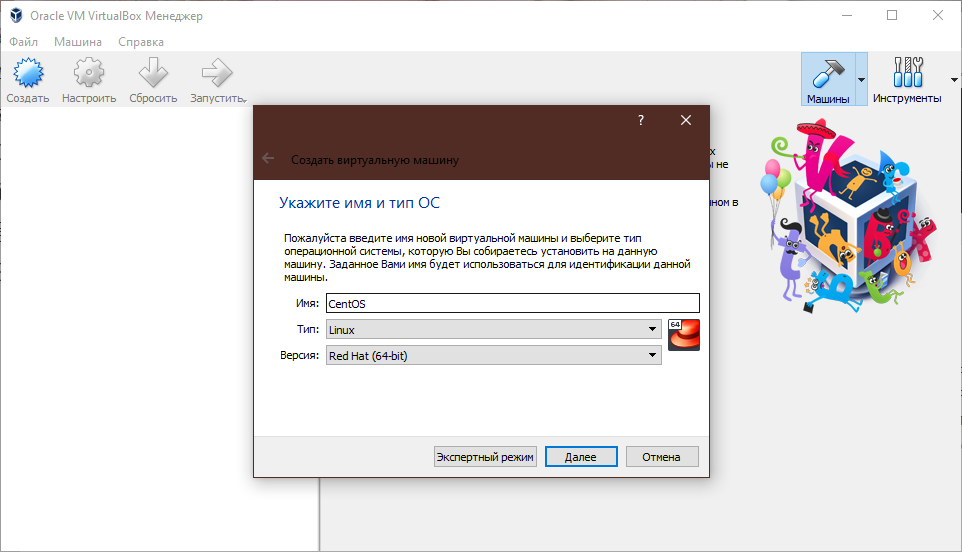
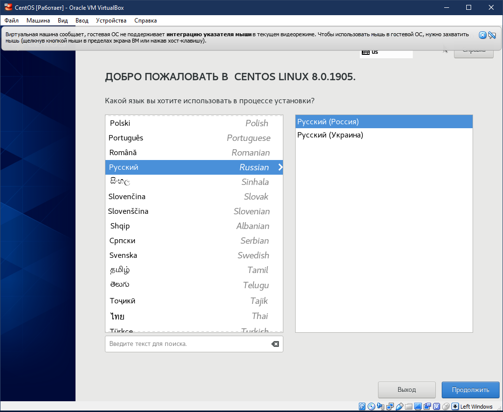
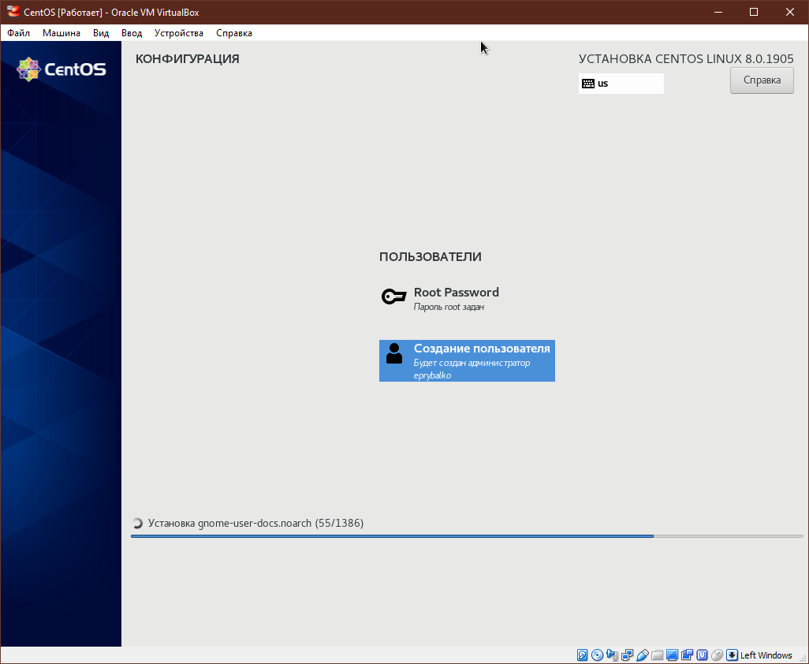
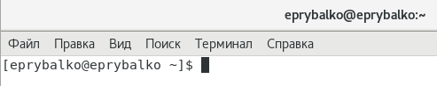
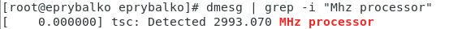
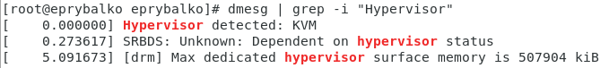

---
# Front matter
lang: ru-RU  
title: "Отчёт по лабораторной работе №1"  
subtitle: "дисциплина: Информационная безопасность"  
author: "Рыбалко Элина Павловна"  
teacher: "Дмитрий Сергеевич Кулябов"

# Generic otions
lang: ru-RU
toc-title: "Содержание"

# Bibliography
bibliography: bib/cite.bib
csl: pandoc/csl/gost-r-7-0-5-2008-numeric.csl

# Pdf output format
toc: true # Table of contents
toc_depth: 2
lof: true # List of figures
lot: true # List of tables
fontsize: 12pt
linestretch: 1.5
papersize: a4
documentclass: scrreprt
## I18n
polyglossia-lang:
  name: russian
  options:
  - spelling=modern
  - babelshorthands=true
polyglossia-otherlangs:
  name: english
### Fonts
mainfont: PT Serif
romanfont: PT Serif
sansfont: PT Sans
monofont: PT Mono
mainfontoptions: Ligatures=TeX
romanfontoptions: Ligatures=TeX
sansfontoptions: Ligatures=TeX,Scale=MatchLowercase
monofontoptions: Scale=MatchLowercase,Scale=0.9
## Biblatex
biblatex: true
biblio-style: "gost-numeric"
biblatexoptions:
  - parentracker=true
  - backend=biber
  - hyperref=auto
  - language=auto
  - autolang=other*
  - citestyle=gost-numeric
## Misc options
indent: true
header-includes:
  - \linepenalty=10 # the penalty added to the badness of each line within a paragraph (no associated penalty node) Increasing the value makes tex try to have fewer lines in the paragraph.
  - \interlinepenalty=0 # value of the penalty (node) added after each line of a paragraph.
  - \hyphenpenalty=50 # the penalty for line breaking at an automatically inserted hyphen
  - \exhyphenpenalty=50 # the penalty for line breaking at an explicit hyphen
  - \binoppenalty=700 # the penalty for breaking a line at a binary operator
  - \relpenalty=500 # the penalty for breaking a line at a relation
  - \clubpenalty=150 # extra penalty for breaking after first line of a paragraph
  - \widowpenalty=150 # extra penalty for breaking before last line of a paragraph
  - \displaywidowpenalty=50 # extra penalty for breaking before last line before a display math
  - \brokenpenalty=100 # extra penalty for page breaking after a hyphenated line
  - \predisplaypenalty=10000 # penalty for breaking before a display
  - \postdisplaypenalty=0 # penalty for breaking after a display
  - \floatingpenalty = 20000 # penalty for splitting an insertion (can only be split footnote in standard LaTeX)
  - \raggedbottom # or \flushbottom
  - \usepackage{float} # keep figures where there are in the text
  - \floatplacement{figure}{H} # keep figures where there are in the text
---

# Цель работы

Целью данной работы является приобретение практических навыков установки операционной системы на виртуальную машину, настройки минимально необходимых для дальнейшей работы сервисов.

#  Техническое обеспечение
Лабораторная работа подразумевает установку на виртуальную машину VirtualBox (https://www.virtualbox.org/) операционной системы Linux (дистрибутив Rocky (https://rockylinux.org/) или CentOS (https://
www.centos.org/)).
Выполнение работы возможно как в дисплейном классе факультета физико-математических и естественных наук РУДН, так и дома. Описание выполнения работы приведено для дисплейного класса со следующими характеристиками:
– Intel Core i3-550 3.2 GHz, 4 GB оперативной памяти, 20 GB свободного
места на жёстком диске;
– ОС Linux Gentoo (http://www.gentoo.ru/);
– VirtualBox верс. 6.1 или старше;
– каталог с образами ОС для работающих в дисплейном классе: /afs/dk.sci.pfu.edu.ru/common/files/iso/.
  

## Объект/Предмет исследования

Операционная система Linux.

# Теоретическое введение

Установка операционных систем на VirtualBox. VirtualBox представляет собой виртуальную машину с возможностью запустить операционные системы, отличные от установленной на компьютере. Это обычно требуется для тестирования ОС, получения информации о системах и их особенностях. Инсталлировав какую-либо ОС на VirtualBox можно выполнять задачи, неосуществимые на основной операционке.  [[2]](#список-литературы).

# Выполнение лабораторной работы

## 1. Установка

Создайте новую виртуальную машину (см. рис. -@fig:001).

{ #fig:001} 

Укажите имя виртуальной машины, тип операционной системы — Linux, RedHat (см. рис. -@fig:002).

{ #fig:002} 

Запустите виртуальную машину и перейдите к настройкам установки операционной системы (см. рис. -@fig:003, -@fig:004, -@fig:005, -@fig:006, -@fig:007).

{ #fig:003} 

Включите сетевое соединение (см. рис. -@fig:004).

{ #fig:004} 

{ #fig:005} 

{ #fig:006} 

{ #fig:007} 

## 2. Установка имени пользователя и названия хоста

1. Запустите виртуальную машину и залогиньтесь (см. рис. -@fig:008).

{ #fig:008} 

2. Запустите терминал и получите полномочия администратора: su - (см. рис. -@fig:009).

{ #fig:009} 

3. Создайте пользователя (вместо username укажите ваш логин в дисплейном классе): adduser -G wheel username (см. рис. -@fig:010).

{ #fig:010} 

4. Задайте пароль для пользователя (вместо username укажите ваш логин в дисплейном классе): passwd username (см. рис. -@fig:011).

{ #fig:011} 

5. Установите имя хоста (вместо username укажите ваш логин в дисплейном классе): hostnamectl set-hostname username (см. рис. -@fig:012).

{ #fig:012} 

6. Проверьте, что имя хоста установлено верно: hostnamectl (см. рис. -@fig:013).

{ #fig:013} 

## 3. Домашнее задание

Дождитесь загрузки графического окружения и откройте терминал. В окне
терминала проанализируйте последовательность загрузки системы, выполнив команду dmesg. Можно просто просмотреть вывод этой команды: dmesg | less
Можно использовать поиск с помощью grep: dmesg | grep -i "то, что ищем"
Получите следующую информацию.

1. Версия ядра Linux (Linux version) (см. рис. -@fig:014). 

{ #fig:014} 
 
2. Частота процессора (Detected Mhz processor) (см. рис. -@fig:015).

{ #fig:015}

3. Модель процессора (CPU0) (см. рис. -@fig:016).

{ #fig:016} 

4. Объем доступной оперативной памяти (Memory available) (см. рис. -@fig:017).
 
{ #fig:017} 

5. Тип обнаруженного гипервизора (Hypervisor detected) (см. рис. -@fig:018).

{ #fig:018}

6. Тип файловой системы корневого раздела (см. рис. -@fig:019).

{ #fig:019} 

7. Последовательность монтирования файловых систем (см. рис. -@fig:020).

{ #fig:020} 

# Вывод

Приобрели практические навыки установки операционной системы на виртуальную машину, настройки минимально необходимых для дальнейшей работы сервисов. 

# Контрольные вопросы

1. Учётная запись пользователя содержит его системное имя.
2. Команды терминала:
– для получения справки по команде: help, man, info
Пример (вывод информации о команде man): man man;
– для перемещения по файловой системе: cd
Например, команда cd /tmp;
– для просмотра содержимого каталога: ls;
– для определения объёма каталога: df;
– для создания / удаления каталогов / файлов: mkdir/rmdir/rm;
– для задания определённых прав на файл / каталог: chmod;
– для просмотра истории команд: history.
3. Файловая  система – это порядок, определяющий способ организации, хранения и именования данных на носителях информации в компьютерах, а также в другом электронном оборудовании. 
Пример: Extended Filesystem - это стандартная файловая система для Linux. Она была разработана еще для Minix.
4. Чтобы посмотреть, какие файловые системы подмонтированы в ОС, используем команду mount.
5. Зависший процесс можно удалить используем комбинацию Ctrl+C, если это возможно, затем SIGTERM - он хоть и завершает процесс, в крайнем случае - SIGKILL.

# Список литературы {.unnumbered}

1. [Лабораторная работа №1](https://docviewer.yandex.ru/view/289699604/?*=qb5co40PAqm3sAEZ4W7OEfZn6K97InVybCI6Imh0dHBzOi8vc3R1ZC1zY2kucnVkbi5ydS9wbHVnaW5maWxlLnBocC8xODgzMC9tb2RfZm9sZGVyL2NvbnRlbnQvMC8wMDEtbGFiX3ZpcnR1YWxib3gucGRmP2ZvcmNlZG93bmxvYWQ9MSIsInRpdGxlIjoiMDAxLWxhYl92aXJ0dWFsYm94LnBkZj9mb3JjZWRvd25sb2FkPTEiLCJub2lmcmFtZSI6dHJ1ZSwidWlkIjoiMjg5Njk5NjA0IiwidHMiOjE2NjI3NTM5MzI4OTYsInl1IjoiMzYxMDQwMTYzMTY0NzI1ODkwNiIsInNlcnBQYXJhbXMiOiJ0bT0xNjYyNzUzODkzJnRsZD1ydSZsYW5nPXJ1Jm5hbWU9MDAxLWxhYl92aXJ0dWFsYm94LnBkZj9mb3JjZWRvd25sb2FkPTEmdGV4dD0lRDAlOUIlRDAlQjAlRDAlQjElRDAlQkUlRDElODAlRDAlQjAlRDElODIlRDAlQkUlRDElODAlRDAlQkQlRDAlQjAlRDElOEYrJUQxJTgwJUQwJUIwJUQwJUIxJUQwJUJFJUQxJTgyJUQwJUIwKyVFMiU4NCU5NisxLislRDAlQTMlRDElODElRDElODIlRDAlQjAlRDAlQkQlRDAlQkUlRDAlQjIlRDAlQkElRDAlQjArJUQwJUI4KyVEMCVCQSVEMCVCRSVEMCVCRCVEMSU4NCVEMCVCOCVEMCVCMyVEMSU4MyVEMSU4MCVEMCVCMCVEMSU4NiVEMCVCOCVEMSU4RislRDAlQkUlRDAlQkYlRDAlQjUlRDElODAlRDAlQjAlRDElODYlRDAlQjglRDAlQkUlRDAlQkQlRDAlQkQlRDAlQkUlRDAlQjkrJUQxJTgxJUQwJUI4JUQxJTgxJUQxJTgyJUQwJUI1JUQwJUJDJUQxJThCKyVEMCVCRCVEMCVCMCslRDAlQjIlRDAlQjglRDElODAlRDElODIlRDElODMlRDAlQjAlRDAlQkIlRDElOEMlRDAlQkQlRDElODMlRDElOEUrJUQwJUJDJUQwJUIwJUQxJTg4JUQwJUI4JUQwJUJEJUQxJTgzKzEuMS4rJUQwJUE2JUQwJUI1JUQwJUJCJUQxJThDKyVEMSU4MCVEMCVCMCVEMCVCMSVEMCVCRSVEMSU4MiVEMSU4QislRDAlQTYlRDAlQjUlRDAlQkIlRDElOEMlRDElOEUrJUQwJUI0JUQwJUIwJUQwJUJEJUQwJUJEJUQwJUJFJUQwJUI5KyVEMSU4MCVEMCVCMCVEMCVCMSVEMCVCRSVEMSU4MiVEMSU4QislRDElOEYlRDAlQjIlRDAlQkIlRDElOEYlRDAlQjUlRDElODIlRDElODElRDElOEYrJUQwJUJGJUQxJTgwJUQwJUI4JUQwJUJFJUQwJUIxJUQxJTgwJUQwJUI1JUQxJTgyJUQwJUI1JUQwJUJEJUQwJUI4JUQwJUI1KyVEMCVCRiVEMSU4MCVEMCVCMCVEMCVCQSVEMSU4MiVEMCVCOCVEMSU4NyVEMCVCNSVEMSU4MSVEMCVCQSVEMCVCOCVEMSU4NSslRDAlQkQlRDAlQjAlRDAlQjIlRDElOEIlRDAlQkElRDAlQkUlRDAlQjIrJUQxJTgzJUQxJTgxJUQxJTgyJUQwJUIwJUQwJUJEJUQwJUJFJUQwJUIyJUQwJUJBJUQwJUI4KyVEMCVCRSVEMCVCRiVEMCVCNSVEMSU4MCVEMCVCMCVEMSU4NiVEMCVCOCVEMCVCRSVEMCVCRCVEMCVCRCVEMCVCRSVEMCVCOSslRDElODElRDAlQjglRDElODElRDElODIlRDAlQjUlRDAlQkMlRDElOEIrJUQwJUJEJUQwJUIwKyVEMCVCMiVEMCVCOCVEMSU4MCVEMSU4MiVEMSU4MyVEMCVCMCVEMCVCQiVEMSU4QyVEMCVCRCVEMSU4MyVEMSU4RSslRDAlQkMlRDAlQjAlRDElODglRDAlQjglRDAlQkQlRDElODMlMkMrJUQwJUJEJUQwJUIwJUQxJTgxJUQxJTgyJUQxJTgwJUQwJUJFJUQwJUI5JUQwJUJBJUQwJUI4KyVEMCVCQyVEMCVCOCVEMCVCRCVEMCVCOCVEMCVCQyVEMCVCMCVEMCVCQiVEMSU4QyVEMCVCRCVEMCVCRSslRDAlQkQlRDAlQjUlRDAlQkUlRDAlQjElRDElODUlRDAlQkUlRDAlQjQlRDAlQjglRDAlQkMlRDElOEIlRDElODUrJUQwJUI0JUQwJUJCJUQxJThGKyVEMCVCNCVEMCVCMCVEMCVCQiVEMSU4QyVEMCVCRCVEMCVCNSVEMCVCOSVEMSU4OCVEMCVCNSVEMCVCOSslRDElODAlRDAlQjAlRDAlQjElRDAlQkUlRDElODIlRDElOEIrJUQxJTgxJUQwJUI1JUQxJTgwJUQwJUIyJUQwJUI4JUQxJTgxJUQwJUJFJUQwJUIyLisxLjIuKyVEMCVBMyVEMCVCQSVEMCVCMCVEMCVCNyVEMCVCMCVEMCVCRCVEMCVCOCVEMSU4RislRDAlQkErJUQxJTgwJUQwJUIwJUQwJUIxJUQwJUJFJUQxJTgyJUQwJUI1KzEuMi4xLislRDAlQTIlRDAlQjUlRDElODUlRDAlQkQlRDAlQjglRDElODclRDAlQjUlRDElODElRDAlQkElRDAlQkUlRDAlQjUrJUQwJUJFJUQwJUIxJUQwJUI1JUQxJTgxJUQwJUJGJUQwJUI1JUQxJTg3JUQwJUI1JUQwJUJEJUQwJUI4JUQwJUI1KyVEMCU5QiVEMCVCMCVEMCVCMSVEMCVCRSVEMSU4MCVEMCVCMCVEMSU4MiVEMCVCRSVEMSU4MCVEMCVCRCVEMCVCMCVEMSU4RislRDElODAlRDAlQjAlRDAlQjElRDAlQkUlRDElODIlRDAlQjArJUQwJUJGJUQwJUJFJUQwJUI0JUQxJTgwJUQwJUIwJUQwJUI3JUQxJTgzJUQwJUJDJUQwJUI1JUQwJUIyJUQwJUIwJUQwJUI1JUQxJTgyKyVEMSU4MyVEMSU4MSVEMSU4MiVEMCVCMCVEMCVCRCVEMCVCRSVEMCVCMiVEMCVCQSVEMSU4MyslRDAlQkQlRDAlQjArJUQwJUIyJUQwJUI4JUQxJTgwJUQxJTgyJUQxJTgzJUQwJUIwJUQwJUJCJnVybD1odHRwcyUzQS8vc3R1ZC1zY2kucnVkbi5ydS9wbHVnaW5maWxlLnBocC8xODgzMC9tb2RfZm9sZGVyL2NvbnRlbnQvMC8wMDEtbGFiX3ZpcnR1YWxib3gucGRmJTNGZm9yY2Vkb3dubG9hZCUzRDEmbHI9MTA2NjgmbWltZT1wZGYmbDEwbj1ydSZzaWduPTdjZWZjZmQ0YWRhNjQzZGEwY2RiN2U5MGE3MzMzYjU2JmtleW5vPTAifQ%3D%3D&amp;lang=ru)
2. [УСТАНОВКА ОПЕРАЦИОННЫХ СИСТЕМ НА VIRTUALBOX](https://nastroyvse.ru/programs/review/kak-ustanavlivat-operacionnye-sistemy-na-virtualbox.html)
3. [Руководство по формуле Cmd Markdown](https://russianblogs.com/article/26051452570/)
4. [Руководство по оформлению Markdown файлов](https://gist.github.com/Jekins/2bf2d0638163f1294637)